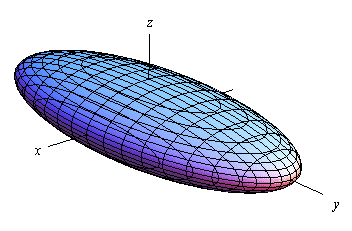
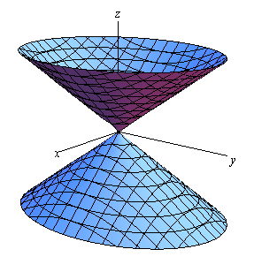
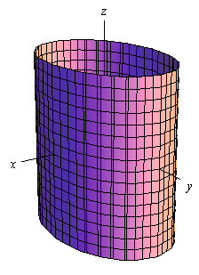

#+TITLE: MATH 110C notes
#+AUTHOR: Ziky Zhang
#+OPTIONS: tex:t toc:t
#+STARTUP: latexpreview org-startup-with-inline-images
#+LATEX_HEADER: \setlength{\abovedisplayskip}{0pt}
#+LATEX_HEADER: \setlength{\belowdisplayskip}{0pt}
#+LATEX_HEADER: \usepackage[a4paper, margin=1in]{geometry}
this note condensed [[https://tutorial.math.lamar.edu/Classes/CalcIII/CalcIII.aspx][Paul's Online Math Notes]] that fits my need for understanding this class, so some details might be missing and some explanation might seems like random crap.

\newpage
* [[https://tutorial.math.lamar.edu/Classes/CalcIII/3DSpace.aspx][3-Dimensional Space]]
** [[https://tutorial.math.lamar.edu/Classes/CalcIII/QuadricSurfaces.aspx][Quadric Surfaces]]
- Ellipsoid
\[
\frac{x^2}{a^2} + \frac{y^2}{b^2} + \frac{z^2}{c^2} = 1
\]
Equation Explanation: $x$, $y$, $z$ are all to the second degree, $a$, $b$, $c$ are the distance from origin to $x_{max}$, $y_{max}$, $z_{max}$, respectively.
#+NAME: figure:1.4.1
#+ATTR_LATEX: :width 6cm

;; NOTE: sphere is also a type of ellipsoid, that happens when \( a = b = c \).

- Cone
\begin{align*}
\frac{x^2}{a^2} + \frac{y^2}{b^2} &= \frac{z^2}{c^2} \\
\frac{x^2}{a^2} + \frac{y^2}{b^2} - \frac{z^2}{c^2} &= 0
\end{align*}
Equation Explanation: two of the three variables are positive and one is negative. the direction of the top and bottom are determined by negative variable, to both the positive and negative direction of that axis.
#+NAME: figure:1.4.2
#+ATTR_LATEX: :width 6cm

- Cylinder
\begin{align*}
\frac{x^2}{a^2} + \frac{y^2}{b^2} = 1
\end{align*}
Equation Explanation: cylinders lacks one of the three variables, that means that the 2-D graph of the equation on their plane (xy-plane in this case) streches all the way on the missing axis (z-axis in this case).
#+NAME: figure:1.4.3
#+ATTR_LATEX: :width 6cm

;; NOTE: a cylinder doesn't have to be a enclosed 
