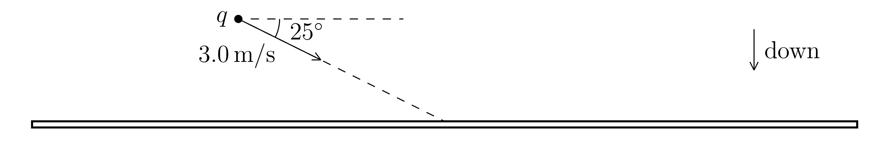
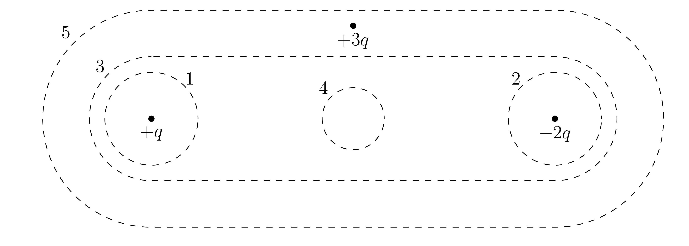
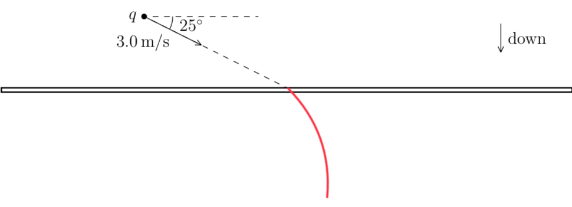

#+TITLE: Worksheet #3
#+AUTHOR: Ziky Zhang
#+OPTIONS: tex:t toc:nil
#+STARTUP: latexpreview
#+LATEX_HEADER: \setlength{\abovedisplayskip}{0pt}
#+LATEX_HEADER: \setlength{\belowdisplayskip}{0pt}
#+LATEX_HEADER: \usepackage[a4paper, margin=1in]{geometry}

1. A particle of charge \( -2.0 \mu C\) and mass \( 0.53g \) is launched towards an infinite plane of uniform surface charge density, and moves along the straight line path indicated Gravity cannot be neglected. Charge \( q \) launched towards plane with an initial velocity of \( 3.0 m/s \) \( 25^{\circ} \) below horizontal 
   1. Calculate the magnitude of the electric field due to the plane of charge.
   2. Suppose the particle passes through a small hole in the plane of charge (i.e., the particle does not collide with the plane, but passes straight through it).  Sketch the path of the particle after it passes through the hole.
   3. How far away from the plane of charge is the particle \( 2.0s \) after it passes through the hole?
2. Calculate \( \oint \vec{E} \cdot d \vec{A} \) for each surface indicated in the diagram below. 

\newpage
1. Since the trajectory of the charge before passing theough the plane is straight, we know that the electrical force on the charge by the plane must be opposite in direction but has the same magnitude. Therefore \( \overrightarrow{F_{e}} = - \overrightarrow{F_{g}} \). Let down be the negative direction.

1.(a)
\begin{align*}
E &= \frac{\overrightarrow{F_{e}}}{q} \\
         &= - \frac{m \overrightarrow{g}}{q} \\
         &= - \frac{0.53g \cdot -9.81 m/s^{2}}{-2.0 \mu C} \\
         &= - 2.59965 \frac{N}{\mu C}
\end{align*}

1.(b) The balance between gravitational force and electrical force on the particle due to the infinite plane breaks, since both the plane and the particle are negatively charged and the particle is now below the plane, the force from plane onto particle is now downwards. While the gravitational force is still pulling the particle downwards and have the same magnitude as the electrical force, the force pushing the particle down is now \( 2 \cdot \overrightarrow{F_g} \).

\begin{align*}
\begin{aligned}[t]
\overrightarrow{F_{net}} &= \overrightarrow{F_{e}} + \overrightarrow{F_{g}} \\
                         &= 2 \overrightarrow{F_{g}} \\
                         &= 2 m \overrightarrow{g} \\
                         &= 2 \cdot 0.53g \cdot -9.81 m/s^2 \\
                         &= 1.06 \times 10^{-4} kg \cdot -9.81 m/s^2 \\
                         &= -1.03986 \times 10^{-3} N 
\end{aligned}
\begin{aligned}[t]
\text{and the acceleration is }
\overrightarrow{a} &= \frac{\overrightarrow{F_{net }}}{m} \\
                   &= \frac{-1.03986 \times 10^{-3} N}{5.3 \times 10^{-5}g} \\
                   &= -19.62 m/s^2
\end{aligned}
\end{align*}

1.(c) Though, the force pushing/pulling onto the particle is now stronger, it is pushing/pulling directly downwards, initial horizontal velocity was not affected.
\begin{align*}
d_x &= v_0 \cos(\theta) \cdot t \\
    &= 3.0m/s \cdot \cos(335^{\circ}) \cdot 2.0s \\
    &= 6.0m \cdot \cos(335^{\circ}) \\
    &= 6.0m \cdot 0.906 \\
    &= 5.436m
\end{align*}

To get vertical distance, we not only need to calculate how the particle behave due to gravity and electrical force, also need to carry the vertical velocity from above the plane.
\begin{align*}
d_y &= \frac12 at^2 + v_0 t + d_0 \\
    &= \frac12 \cdot 2gt^2 + v_0 \sin(\theta) t + 0 \\
    &= gt^2 + v_0 \sin(335^{\circ}) t \\
    &= -9.81m/s^2 \cdot (2.0s)^2 + 3.0m/s \cdot -0.423 \cdot 2.0s \\
    &= -39.24m + - 2.538m \\
    &= -41.778m
\end{align*}

\text{2.}
\begin{align*}
\begin{aligned}[t]
\Phi_{E_1} &= \oint \vec{E} \cdot d\vec{A} \\
          &= EA \\
          &= k_e \frac{q}{r^2} \cdot 4 \pi r^{2} \\
          &= + \frac{q}{\epsilon_{0}} \\
\\
\Phi_{E_2} &= \oint \vec{E} \cdot d\vec{A} \\
           &= EA \\
           &= k_e \frac{-2q}{r^2} \cdot 4 \pi r^{2} \\
           &= - \frac{2q}{\epsilon_{0}} \\
\end{aligned}
\qquad
\begin{aligned}[t]
\Phi_{E_3} = \oint \vec{E} \cdot d\vec{A} &= \frac{q_{enc}}{\epsilon_0} \\
&= \frac{+q -2q}{\epsilon_0} \\
&= -\frac{q}{\epsilon_0}
\\
\Phi_{E_4} &= \oint \vec{E} \cdot d\vec{A} \\
           &= EA \\
           &= k_e \frac{0}{r^2} \cdot 4 \pi r^{2} \\
           &= 0
\\
\Phi_{E_5} = \oint \vec{E} \cdot d\vec{A} &= \frac{q_{enc}}{\epsilon_0} \\
&= \frac{+q -2q + 3q}{\epsilon_0} \\
&= \frac{2q}{\epsilon_0}
\end{aligned}
\end{align*}

