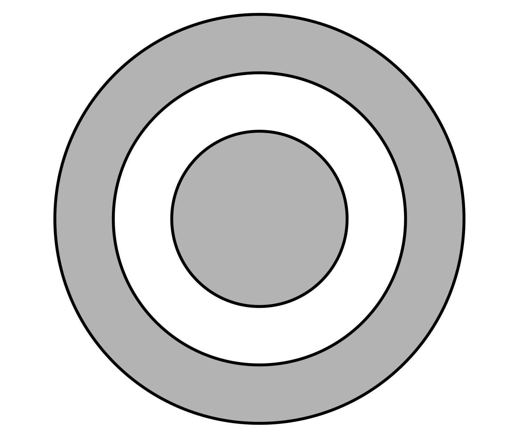

#+TITLE: Worksheet #4
#+AUTHOR: Ziky Zhang
#+OPTIONS: tex:t toc:nil
#+STARTUP: latexpreview
#+LATEX_HEADER: \setlength{\abovedisplayskip}{0pt}
#+LATEX_HEADER: \setlength{\belowdisplayskip}{0pt}
#+LATEX_HEADER: \usepackage[a4paper, margin=1in]{geometry}
1. Pictured below is a spherical conducting ball of radius \( a \) surrounded by a spherical non-conducting "thick" shell of inner radius \( b \) and outer radius \( c \).  The conducting ball has a total charge of \( Q_1 \) and the non-conducting shell has a total charge of \( Q_2 \) uniformly distributed throughout its volume (i.e., the volume charge density \( \rho \) for the shell is constant). 
   1. Determine the volume charge density \( \rho \) of the non-conducting shell.
   2. Determine the electric field at a point a distance \( r \) from the center of the conducting ball. Consider separately each case: \( r < a \) , \( a < r \leq b \), \( b \leq r \leq c \), and \( r \leq c \).
   3. If \( Q_2 = -2Q_1 \), for which values of \( r \) is the electric field zero?

\newpage
1.(a) The volume of the shell can be found by using outer radius to find the volume of the ball, and take out the volume of the inner empty part, \( \frac{4}{3} \pi c^2 - \frac{4}{3} \pi b^2 \). And the uniformed density of charge of that volume can be found by \( \rho = \frac{Q}{V} \).
\begin{align*}
\rho_{shell} &= \frac{Q_{2}}{\frac{4}{3} \pi c^3 - \frac{4}{3} \pi b^3} \\
     &= \frac{Q_{2}}{\frac{4}{3} \pi ( c^3 - b^3 )} \\
     &= \frac{3 Q_{2}}{4 \pi ( c^3 - b^3 )} \\
\end{align*}

1.(b)

\begin{align*}
\begin{aligned}[t]
\text{The gaussian surfac}&\text{e of choice is always} \\
\text{sphere with radius }&\text{\( r \) for each cases.} \\
\Phi_{E} = \frac{Q_{enc}}{\epsilon_{0}} &= \oint E \cdot dA \\
\frac{Q_{enc}}{\epsilon_{0}} &= EA \\
E &= \frac{Q_{enc}}{\epsilon_{0} A} \hat{r} \\
E &= \frac{Q_{enc}}{\epsilon_{0} \cdot 4 \pi r^2} \hat{r} \\
E &= k_e \frac{Q_{enc}}{r^2} \hat{r}
\end{aligned}
\qquad
\begin{aligned}[t]
\text{Let's also solve}&\text{ for \( Q_{2, enc} \) for later use:} \\
\rho &= \frac{Q}{V} \\
\rho_{shell} &= \frac{Q_{2, enc}}{\frac{4}{3} \pi (r^3 - b^3)} \\
Q_{2, enc} &= \frac{4}{3} \pi (r^3 - b^3) \cdot \rho_{shell}
\end{aligned}
\end{align*}

\begin{align*}
\begin{aligned}[t]
&r < a: \\
&E_1 = 0
\end{aligned}
\qquad
\begin{aligned}[t]
a &< r \leq b: \\
E_2 &= k_e \frac{Q_{enc}}{r^2} \hat{r} \\
E_2 &= k_e \frac{Q_1}{r^2} \hat{r} \\
\end{aligned}
\qquad
\begin{aligned}[t]
b &\leq r \leq c: \\
E_3 &= k_e \frac{Q_{enc}}{r^2} \hat{r} \\
E_3 &= k_e \frac{Q_1 + Q_{2,enc}}{r^2} \hat{r} \\
E_3 &= k_e \frac{Q_1 + \frac{4}{3} \pi (r^3 - b^3) \cdot \rho_{shell}}{r^2} \hat{r}
\end{aligned}
\quad
\begin{aligned}[t]
r &\geq c \\
E_4 &= k_e \frac{Q_{enc}}{r^2}\hat{r} \\
E_4 &= k_e \frac{Q_1 + Q_{2}}{r^2}\hat{r} \\
\end{aligned}
\end{align*}

\newpage
1.(c) If \( Q_2 = -2Q_1 \), for which values of \( r \) is the electric field zero?
\begin{align*}
\rho_{shell, new} &= \frac{3 Q_{2}}{4 \pi ( c^3 - b^3 )} \\
    &= \frac{3 \cdot -2Q_1}{4 \pi ( c^3 - b^3 )} \\
    &= - \frac{3 Q_1}{2 \pi ( c^3 - b^3 )} \\
\end{align*}

\begin{align*}
E_3 = 0 &= k_e \frac{Q_1 + \frac{4}{3} \pi (r^3 - b^3) \cdot \rho_{shell, new}}{r^2} \\
    &= k_e \frac{Q_1 + \frac{4}{3} \pi (r^3 - b^3) \cdot - \frac{3 Q_1}{2 \pi ( c^3 - b^3 )}}{r^2} \\
    &= k_e \frac{Q_1 - 2 (r^3 - b^3) \cdot - \frac{Q_1}{c^3 - b^3}}{r^2} \\
    &= \frac{k_e Q_1}{r^2} (1 - 2 \frac{r^3 - b^3}{c^3 - b^3}) \\
    &= 1 - 2 \frac{r^3 - b^3}{c^3 - b^3} \\
  1 &= 2 \frac{r^3 - b^3}{c^3 - b^3} \\
r^3 - b^3 &= \frac{c^3 - b^3}{2} \\
r^3 &= \frac{c^3 - b^3}{2} + b^3 \\
  r &= \sqrt[3]{\frac{c^3 - b^3}{2} + b^3} \\
\end{align*}
