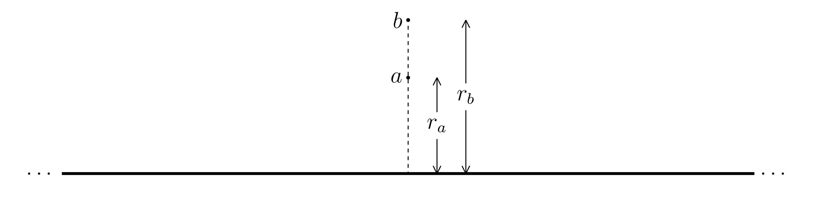
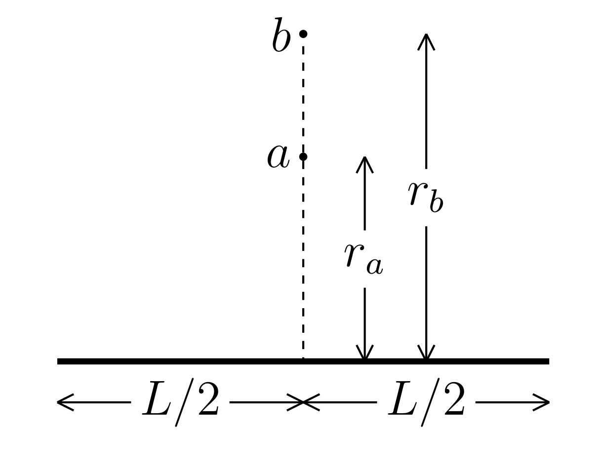

#+TITLE: Worksheet #5
#+AUTHOR: Ziky Zhang
#+OPTIONS: tex:t toc:nil
#+STARTUP: latexpreview
#+LATEX_HEADER: \setlength{\abovedisplayskip}{0pt}
#+LATEX_HEADER: \setlength{\belowdisplayskip}{0pt}
#+LATEX_HEADER: \usepackage[a4paper, margin=1in]{geometry}
1. Answer the following:
   1. Calculate the potential difference \( V_b - V_a \) due to the infinite rod of uniform charge density λ, as shown below. Perform this calculation by directly integrating the electric field over a path between \( a \) and \( b \). \\
      Two points \( a \) and \( b \), distances \( r_a \) and \( r_b \), respectively, away from a long rod
      #+ATTR_LATEX: :height 3cm
      
   2. Calculate the potential difference \( V_b - V_a \) due to the rod of length \( L \) and uniform charge density \( \lambda \), as shown below. Perform this calculation by calculating \( Va \) and \( Vb \) directly from the charge distribution and subtracting. \\
      Two points \( a \) and \( b \), distances \( r_a \) and \( r_b \), respectively from the center of a rod of length \( L \)
      #+ATTR_LATEX: :height 3cm
      
   3. Show that your answer to part b matches your answer to part a in the \( \lim_{L\to\infty} \).

\newpage
1.(a)
\begin{align*}
V_b - V_a &= - \int_{r_a}^{r_b} E dr \\
          &= - \int_{r_a}^{r_b} \frac{\lambda}{2 \pi \epsilon_0 r} dr \\
          &= - \frac{\lambda}{2 \pi \epsilon_0} \int_{r_a}^{r_b} \frac{1}{r} dr \\
          &= - \frac{\lambda}{2 \pi \epsilon_0} \ln{r} \big|_{r_a}^{r_b} \\
          &= - \frac{\lambda}{2 \pi \epsilon_0} (\ln{r_b} - \ln{r_a}) \\
          &= - \frac{\lambda}{2 \pi \epsilon_0} \ln{\frac{r_{b}}{r_a}}
\end{align*}
\newline
1.(b)
\begin{align*}
\begin{aligned}[t]
V(r) &= \int_{0}^{L} E dr \\
     &= \int_{0}^{L} k_e \frac{\lambda dx}{\sqrt{r^2 + x^2}} \\
     &= k_e \lambda \int_{0}^{L} \frac{1}{\sqrt{r^2 + x^2}} dx \\
     &= k_e \lambda \ln \big(\big| \sqrt{x^2 + r^2} + x \big|\big)  \bigg|_{0}^{L} \\
     &= k_e \lambda \bigg( \ln \big( \sqrt{L^2 + r^2} + L \big) - \ln \big( \sqrt{0^2 + r^2} + 0 \big) \bigg) \\
     &= k_e \lambda \ln \bigg( \frac{ \sqrt{L^2 + r^2} + L }{r} \bigg)
\end{aligned}
\quad
\begin{aligned}[t]
V_b - V_a &= V(r) \big|_a^b \\
          &= k_e \lambda \ln \bigg( \frac{ \sqrt{L^2 + r_b^2} + L }{r_b} \cdot \frac{r_a}{ \sqrt{L^2 + r_a^2} + L }\bigg) \\
          &= k_e \lambda \ln \bigg( \frac{ \sqrt{L^2 + r_b^2} + L }{r_b} \cdot \frac{r_a}{ \sqrt{L^2 + r_a^2} + L }\bigg) \\
          &= k_e \lambda \ln \bigg( \frac{ r_a (\sqrt{L^2 + r_b^2} + L )}{r_b (\sqrt{L^2 + r_a^2} + L)} \bigg)
\end{aligned}
\end{align*}
\newline
\newline
1.(c) \\
\begin{align*}
\begin{aligned}[t]
\text{part b} \\
V_b - V_a &= \lim_{L \to \infty} V(r) \big|_a^b \\
          &= \lim_{L \to \infty} k_e \lambda \ln \bigg( \frac{ \sqrt{L^2 + r^2} + L }{r} \bigg) \bigg|_a^b\\
          &= k_e \lambda \ln \bigg( \frac{2L}{r} \bigg) \bigg|_a^b\\
          &= 2k_e \lambda \ln \bigg( \frac{L}{r} \bigg) \bigg|_a^b\\
          &= 2k_e \lambda \ln \bigg( \frac{L}{r_b} \cdot \frac{r_a}{L} \bigg) \\
          &= 2k_e \lambda \ln \frac{r_a}{r_b} \\
          &= \frac{\lambda}{2 \pi \epsilon_0} \ln \frac{r_a}{r_b} \\
\end{aligned}
\qquad
\begin{aligned}[t]
\text{part a} \\
V_b - V_a &= - \frac{\lambda}{2 \pi \epsilon_0} \ln{\frac{r_{b}}{r_a}} \\
          &= \frac{\lambda}{2 \pi \epsilon_0} \ln \frac{r_a}{r_b} \\
\\
\text{The an}& \text{swers for these two parts appears to agree}
\end{aligned}
\end{align*}
