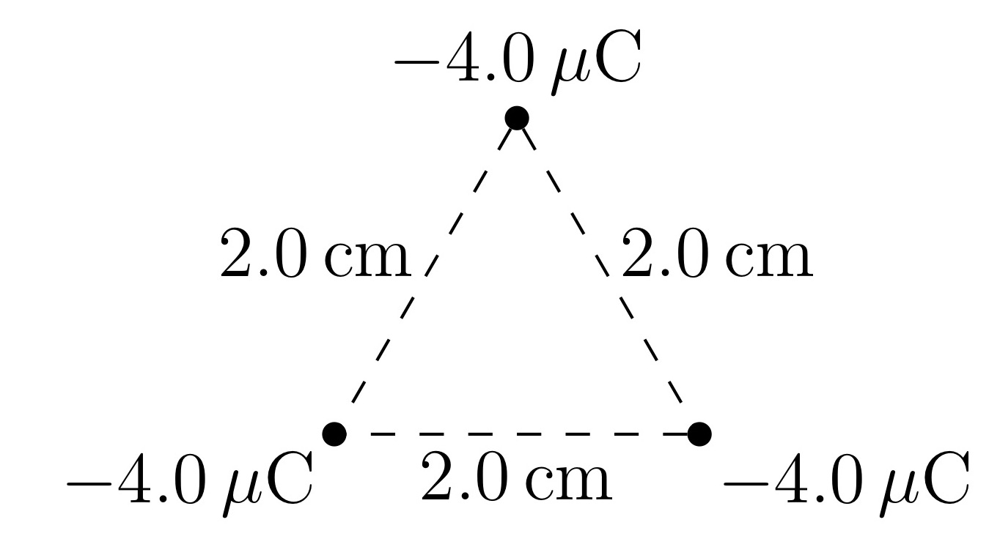
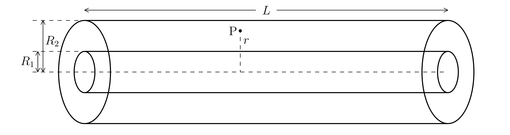

#+TITLE: Worksheet #6
#+AUTHOR: Ziky Zhang
#+OPTIONS: tex:t toc:nil
#+STARTUP: latexpreview
#+LATEX_HEADER: \setlength{\abovedisplayskip}{0pt}
#+LATEX_HEADER: \setlength{\belowdisplayskip}{0pt}
#+LATEX_HEADER: \usepackage[a4paper, margin=1in]{geometry}
1. A spherical conducting ball of radius \( 28cm \) is charged so that the electric potential at the surface of the ball is \( -5600V \) (where \( V_\infty = 0 \)).
   1. What is the electric potential at the center of the ball?
   2. Calculate the total charge on the conductor.
   3. An electron is placed just outside the conducting ball and released from rest (assume that the presence of the electron has negligible effect on the conductor surface charge distribution). How fast is the electron travelling when it reaches a distance of \( 84cm\) away from the center of the ball?
2. Three \( -4.0 \mu C \) charges are distributed as shown below.
   #+ATTR_LATEX: :height 3cm
   #+CAPTION: Three charges located at the vertices of an equilateral triangle of side length \( 2.0 cm \)
   #+LABEL: Figure 6.1
   
   1. Calculate the electrostatic potential energy of the system of charges.
   2. All three charges have a mass of \( 3.6 \times 10^8 kg \), and are released from rest in the configuration shown above.  What is the final speed of each particle after the particles are infinitely far away from each other?
3. A cylindrical capacitor consists of two long, coaxial, metal cylinders of radii \( R1 \) and \( R2 \) (\( R1 < R2 \)) and the same length \( L \), as shown below. Imagine for the moment that the inner cylinder has a total charge of \( +Q \) and the outer cylinder has a total charge of \( -Q \).
   #+ATTR_LATEX: :height 3cm
   #+CAPTION: Two cylindrical shells and an indicated point \( P \) located between them
   #+LABEL: Figure 6.2
   
   1. Use Gauss' Law to calculate the electric field at the point \( P \) in the diagram above, which is a distance \( r \) away from the axis.
   2. Calculate the potential difference between the outer and the inner cylindrical shell. Which shell is at a higher electric potential?
   3. Determine the capacitance of the cylindrical capacitor.

\newline
1.(a) 
Due to the property of electric potential, the entire conductor, including interior points, is at a uniform potential.
So the electric potential at the center of the ball is \( -5600 \text{ V} \).

1.(b)
\begin{align*}
V &= k \frac{q}{r} \\
q &= \frac{Vr}{k} \\
  &= \frac{-5600 \text{V} \cdot .28\text{m}}{8.99 \times 10^9 \text{ Nm}^2\text{C}^{-2}} \\
  &= - \frac{1568 \text{ Nm}^2\text{C}^{-1}}{8.99 \times 10^9 \text{ Nm}^2\text{C}^{-2}} \\
  &= - \frac{1568}{8.99 \times 10^9 \text{ C}^{-1}} \\
  &= - 1.74 \times 10^{-7} \text{ C}
\end{align*}

1.(c)
By the electric potential, we know that the electric potential energy on the electron is \( U_0 = q_eV \). 
\begin{align*}
K_f - K_0 &= U_0 - U_f \\
\frac{1}{2}m_e v^{2} - 0 &= q_e \frac{kq}{r_0} - q_e \frac{kq}{r_f} \\
\frac{1}{2}m_e v^{2} &= q_e kq ( \frac{1}{r_0} - \frac{1}{r_f} ) \\
v^{2} &= 2 \frac{q_e kq}{m_e} ( \frac{1}{r_0} - \frac{1}{r_f}) \\
v &= \sqrt{2 \frac{q_e kq}{m_e} ( \frac{1}{r_0} - \frac{1}{r_f} )} \\
v &= \sqrt{2 \frac{1.602 \times 10^{-19} \text{ C} \cdot 8.99 \times 10^9 \text{ Nm}^2\text{C}^{-2} \cdot - 1.74 \times 10^{-7} \text{C}}{9.11 \times 10^{-31} \text{ kg}} ( \frac{1}{.28 \text{ m}} - \frac{1}{.84 \text{ m}} )} \\
v &= \sqrt{13.10 \times 10^{14} \frac{\text{m}^2}{\text{s}^2}} \\
v &= 3.62 \times 10^{7} \text{m} / \text{s}
\end{align*}

\newpage
2.(a)
\begin{align*}
\begin{aligned}[t]
W_1 &= 0
\end{aligned}
\quad
\begin{aligned}[t]
W_2 &= -q_2 (k \frac{q_1}{r_{12}}) - 0 \\
    &= -q_2 (k \frac{q_1}{r_{12}}) \\
\end{aligned}
\qquad
\begin{aligned}[t]
W_3 &= -q_3 (k \frac{q_1}{r_{13}}) + -q_3 (k \frac{q_2}{r_{23}}) \\
    &= -q_3 k (\frac{q_1}{r_{13}} + \frac{q_2}{r_{23}}) \\
\end{aligned}
\end{align*}
Given that \( q_1 \), \( q_2 \), and \( q_3 \) have the same value of \( -4.0 \ \mu \text{C} \), and \( r_{12} \), \( r_{13} \), and \( r_{23} \) have the same value of \( 2.0 \text{ cm}\)
\begin{align*}
U &= -W_{sys} \\
  &= - ( 0 + - q_2 (k \frac{q_1}{r_{12}}) + - q_3 k (\frac{q_1}{r_{13}} + \frac{q_2}{r_{23}}) ) \\
  &= - ( - q (k \frac{q}{r}) + - q k (\frac{q}{r} + \frac{q}{r}) ) \\
  &= - ( - q (k \frac{q}{r}) - q k (2\frac{q}{r}) ) \\
  &= 3 \frac{q^2 k}{r} \\
  &= 3 \frac{16 \times 10^{-12} \text{ C} \cdot 8.99 \times 10^9 \text{ Nm}^2 \text{C}^{-2}}{.02 \text{m}} \\
  &= 21.576 \text{ J} \\
\end{align*}

2.(b)
\begin{align*}
K_{f, \text{ sys}} - K_{i, \text{ sys}} &= U_{i, \text{ sys}} - U_{f, \text{ sys}} \\
K_{f, \text{ sys}} - 0 &= U_{i, \text{ sys}} - 0 \\
K_{f, \text{ sys}} &= U_{i, \text{ sys}} \\
3(\frac{1}{2} mv^2) &= U_{i, \text{ sys}} \\
v &= \sqrt{ \frac{2U_{i, \text{ sys}}}{3r_0 m}} \\
  &= \sqrt{ \frac{2 \cdot 3kq^2}{3r_0 m}} \\\
  &= \sqrt{ \frac{2 \cdot kq^2}{r_0 m}} \\
  &= \sqrt{ \frac{2 \cdot 8.99 \times 10^9 \text{ Nm}^2 \text{C}^{-2} \cdot (-4 \times 10^{-6} \text{C})^2}{0.02 \text{ m} \cdot 3.6 \times 10^{-8} \text{kg}}} \\
  &= 6.32 \times 10^5 \text{m} / \text{s}
\end{align*}

\newpage
3.(a)
Imagine a cylindrical gaussian surface is placed coaxial with the two capacitors, with radius \( r \).
\begin{align*}
\frac{q_{enc}}{\epsilon_0} &= \oint \overrightarrow{E} \cdot d \overrightarrow{A} \\ 
                   &= \overrightarrow{E} 2 \pi r L \\
\overrightarrow{E} &= \frac{q_{enc}}{2 \pi \epsilon_0 r L} \\
                   &= \frac{q}{2 \pi \epsilon_0 r L} \\
\end{align*}

3.(b)
The inner cylinder has a higher electric potential energy because it has a higher charge.
\begin{align*}
V_2 - V_1 &= - \int^{r_2}_{r_1} \overrightarrow{E} \cdot dr \\
          &= - \int^{r_2}_{r_1} \frac{q}{2 \pi \epsilon_0 rL} dr \\
          &= - \frac{q}{2 \pi \epsilon_0 L} \int^{r_2}_{r_1} \frac{1}{r} dr \\
          &= - \frac{q}{2 \pi \epsilon_0 L} \ln{|r|} \bigg|^{r_2}_{r_1} \\
          &= - \frac{q}{2 \pi \epsilon_0 L} \ln{ \bigg| \frac{r_2}{r_1} \bigg| } \\
\end{align*}

3.(c)
\begin{align*}
C &= \bigg| \frac{q}{V} \bigg| \\
  &= \bigg| q \cdot (- \frac{q}{2 \pi \epsilon_0 L} \ln{\big| \frac{r_2}{r_1} \big|} )^{-1} \bigg| \\
  &= \bigg| q \cdot \frac{2 \pi \epsilon_0 L}{q} \ln{\big| \frac{r_2}{r_1} \big|}^{-1} \bigg| \\
  &= 2 \pi \epsilon_0 L (\ln{ \frac{r_2}{r_1}})^{-1}
\end{align*}
