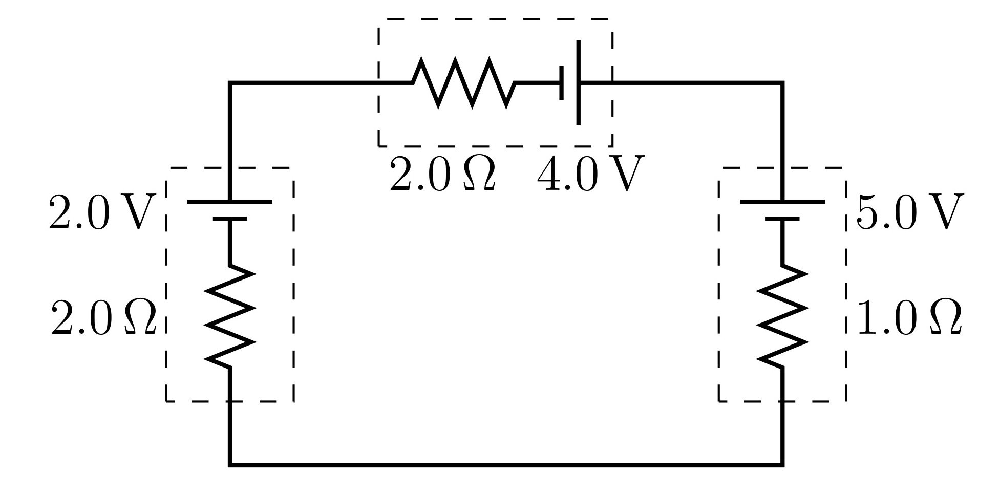

#+TITLE: Worksheet #8
#+AUTHOR: Ziky Zhang
#+OPTIONS: tex:t toc:nil
#+STARTUP: latexpreview
#+LATEX_HEADER: \setlength{\abovedisplayskip}{0pt}
#+LATEX_HEADER: \setlength{\belowdisplayskip}{0pt}
#+LATEX_HEADER: \usepackage[a4paper, margin=1in]{geometry}
1. A long wire with a circular cross-section (\( 1.9 \mathrm{mm} \) diameter) carries a current of \( 8.0 \mathrm{mA} \). The wire is made of a hypothetical material having the following properties:
      - resistivity = \( 5.6 \times 10^{-8} \ \Omega \mathrm{m}\)
      - density = \( 21.4 \ \mathrm{g} / \mathrm{cm}^3 \)
      - atomic mass = \( 138.9055 \ \mathrm{g} / \mathrm{mole}  \)
      - atomic number = \( 59 \)
   1. Calculate the electric field inside the wire.
      The drift velocity is measured (via the Hall Effect, to be discussed in Chapter 28) to be \( 9.50 \times 10^{-8} \ \mathrm{m} / \mathrm{s} \).
   2. Calculate the number density of conduction electrons in the hypothetical material.
   3. On average, how many conduction electrons are available per atom?
2. The filament of a certain light bulb is made of tungsten and has a length of \( 0.48 \mathrm{m} \) and a circular cross-section with a diameter of \( 0.062 \mathrm{mm} \).
   1. Calculate the resistance of the filament at room temperature.
   2. A \( 4.0 \mathrm{V} \) voltage applied to the filament results in a \( 0.078 \mathrm{A} \) current. Determine the temperature of the filament under these conditions.
3. Three batteries are connected in the circuit given below.
   #+ATTR_LATEX: :height 3cm
   #+CAPTION: Single-loop circuit with three batteries
   #+LABEL: Figure 8.1
   
   1. Determine the current through the circuit (be sure to indicate its direction).
   2. Calculate the voltage across each battery.
   3. Determine the rate in which chemical energy is either used or restored in each battery.

\newpage
1.(a)
\begin{align*}
\overrightarrow{E} &= \rho J \\
  &= \rho \frac{I}{A} \\
  &= 5.6 \times 10^{-8} \ \Omega \mathrm{m} \frac{0.008 \mathrm{A}}{\pi (\frac{1}{2} \cdot 0.0019 \mathrm{m})^{2}} \\
  &= 5.6 \times 10^{-8} \ \Omega \mathrm{m} \frac{8 \times 10^{-3} \mathrm{A}}{\pi (9.025 \times 20^{-7} \ \mathrm{m}^{2})} \\
  &= 5.6 \times 10^{-8} \ \Omega \mathrm{m} \frac{8 \times 10^{-3} \mathrm{A}}{2.86 \times 10^{-6} \mathrm{m}^{2}} \\
  &= 5.6 \times 10^{-8} \ \Omega \cdot 2.80 \times 10^{3} \frac{\mathrm{A}}{\mathrm{m}} \\
  &= 1.57 \times 10^{-4} \ \Omega \frac{\mathrm{A}}{\mathrm{m}} \\
\end{align*}

1.(b)
\begin{align*}
J &= ne v_d \\
n_{\mathrm{electron,\  cond}} &= \frac{J}{e v_d} \\
  &= \frac{2.80 \times 10^3 \frac{A}{\mathrm{m}^2}}{1.602 \times 10^{-19} \mathrm{C} \cdot 9.5 \times 10^{-8} \frac{\mathrm{m}}{\mathrm{s}}} \\
  &= \frac{2.80 \times 10^{30} \mathrm{m}^2}{15.219 \mathrm{m}} \\
  &= 1.840 \times 10^{29} \mathrm{m}^{-3}
\end{align*}

1.(c)
\begin{align*}
\begin{aligned}[t]
\text{Variables: }
\rho_{\mathrm{den}} &= 21.4 \ \mathrm{g}/\mathrm{cm}^{3} \\
m &= 138.9055 \ \mathrm{g} / \mathrm{mole} \\
N_A &= 6.022 \times 10^{23} \mathrm{atoms}/\mathrm{mole} \\
\end{aligned}
\qquad
\begin{aligned}[t]
n_{\mathrm{atom}} &= \frac{p_{den} N_A}{m} \\
  &= \frac{21.4 \tfrac{\mathrm{g}}{\mathrm{cm}^{3}} \cdot 6.022 \times 10^{23} \frac{\mathrm{atoms}}{\mathrm{mole}}}{138.9055 \tfrac{\mathrm{g}}{\mathrm{mole}}} \\
  &= \frac{21.4 \times 10^{7} \ \mathrm{g}}{\mathrm{m}^{3}} \cdot \frac{6.022 \times 10^{23} \mathrm{atoms}}{\mathrm{mole}} \cdot \frac{\mathrm{mole}}{138.9055 \ \mathrm{g}} \\
  &= \frac{128.8708 \times 10^{31}}{138.9055 \ \mathrm{m}^{3}} \\
  &= 9.278 \times 10^{28} \mathrm{m}^{-3}
\end{aligned}
\end{align*}
\begin{align*}
\frac{n_{\mathrm{electron, \ cond}}}{n_{\mathrm{atom}}} &= \frac{1.840 \times 10^{29} \mathrm{m}^{-3}}{9.278 \times 10^{28} \mathrm{m}^{-3}} \\
  &\approx 1.983186031 \approx 2 \frac{\mathrm{electrons}}{\mathrm{atom}}
\end{align*}

\newpage
2.(a)
\begin{align*}
\begin{aligned}[t]
\text{Variables: }
\rho &= 5.25 \times 10^{-8} \Omega \mathrm{m}\\
L &= .48 \mathrm{m} \\
d &= .062 \mathrm{mm} = .000062 \mathrm{m}
\end{aligned}
\qquad
\begin{aligned}[t]
R &= \rho \frac{L}{A} \\
  &= 5.25 \times 10^{-8} \Omega \mathrm{m} \cdot \frac{.48 \mathrm{m}}{\pi (d/2)^2} \\
  &= 5.25 \times 10^{-8} \Omega \mathrm{m} \cdot \frac{.48 \mathrm{m}}{3.019 \times 10^{-9} \mathrm{m}^2} \\
  &= \frac{2.52 \times 10^{-8} \Omega \mathrm{m}^2}{3.019 \times 10^{-9} \mathrm{m}^2} \\
  &= 8.347 \Omega
\end{aligned}
\end{align*}

2.(b)
\begin{align*}
\begin{aligned}[t]
\text{Variables: }
V &= 4.0 \mathrm{V} \\
I &= 0.078 \mathrm{A} \\
\rho_0 &= 5.25 \times 10^{-8} \Omega \mathrm{m} \\
T_0 &= 293 \mathrm{K} \\
\alpha &= 4.5 \times 10^{-3} \mathrm{K}^{-1} \\
\end{aligned}
\qquad
\begin{aligned}[t]
\rho - \rho_0 &= \rho_0 \alpha (T - T_0) \\
\rho - \rho_0 &= \rho_0 \alpha T - \rho_0 \alpha T_0 \\
\rho_0 \alpha T &= R \frac{A}{L} - \rho_0 + \rho_0 \alpha T_0 \\
T &= \frac{R \frac{A}{L} - \rho_0 }{\rho_0 \alpha} + T_0 \\
  &= \frac{32.255 \times 10^{-8} \Omega \mathrm{m} - 5.25 \times 10^{-8} \Omega \mathrm{m}}{5.25 \times 10^{-8} \Omega \mathrm{m} \cdot 4.5 \times 10^{-3} \mathrm{K}^{-1}} + 293 \mathrm{K} \\
  &= \frac{27.005 \times 10^{-8} \Omega \mathrm{m}}{5.25 \times 10^{-8} \Omega \mathrm{m} \cdot 4.5 \times 10^{-3}} \mathrm{K} + 293 \mathrm{K} \\
  &= 1143.1 \mathrm{K} + 293 \mathrm{K} \\
  &= 1436.1 \mathrm{K}
\end{aligned}
\end{align*}

3.(a)
\begin{align*}
I &= \frac{\mathcal{E}_{\mathrm{left}} + \mathcal{E}_{\mathrm{top}} - \mathcal{E}_{\mathrm{right}}}{r_{\mathrm{left}} + r_{\mathrm{top}} + r_{\mathrm{right}}} \\
  &= \frac{1.0 \mathrm{V}}{5 \Omega} \\
  &= .2 \mathrm{A, \ clockwise}
\end{align*}

3.(b)
\begin{align*}
\begin{aligned}[t]
\Delta V_{\mathrm{left}} &= - Ir_{\mathrm{left}} + \mathcal{E}_{\mathrm{left}} \\
  &= - .2 \mathrm{A} \cdot 2.0 \Omega + 2.0 \mathrm{V} \\
  &= 1.6 \mathrm{V}
\end{aligned}
\quad
\begin{aligned}[t]
\Delta V_{\mathrm{top}} &= - Ir_{\mathrm{top}} + \mathcal{E}_{\mathrm{top}} \\
  &= - .2 \mathrm{A} \cdot 2.0 \Omega + 4.0 \mathrm{V} \\
  &= 3.6 \mathrm{V}
\end{aligned}
\quad
\begin{aligned}[t]
\Delta V_{\mathrm{right}} &= - Ir_{\mathrm{right}} - \mathcal{E}_{\mathrm{rihgt}} \\
  &= - .2 \mathrm{A} \cdot 1.0 \Omega - 5.0 \mathrm{V} \\
  &= -5.2 \mathrm{V}
\end{aligned}
\end{align*}

3.(c)
\begin{align*}
\begin{aligned}[t]
P_{\mathrm{left}} &= - V_{\mathrm{left}} I \\
  &= - 1.6 \mathrm{V} \cdot .2 \mathrm{A} \\
  &= - 0.32 \mathrm{W}
\end{aligned}
\quad
\begin{aligned}[t]
P_{\mathrm{top}} &= - V_{\mathrm{top}} I \\
  &= - 3.6 \mathrm{V} \cdot .2 \mathrm{A} \\
  &= - 0.72 \mathrm{W}
\end{aligned}
\quad
\begin{aligned}[t]
P_{\mathrm{right}} &= - V_{\mathrm{right}} I \\
  &=  5.2 \mathrm{V} \cdot .2 \mathrm{A} \\
  &=  1.04 \mathrm{W}
\end{aligned}
\quad
\end{align*}
