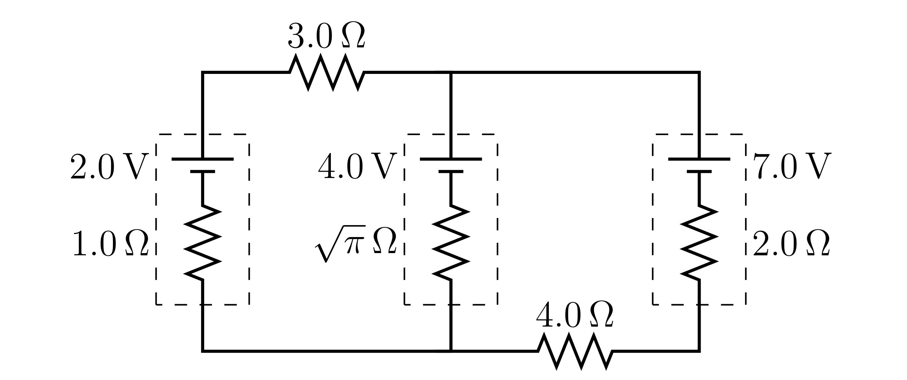

#+TITLE: Worksheet #9
#+AUTHOR: Ziky Zhang
#+OPTIONS: tex:t toc:nil
#+STARTUP: latexpreview
#+LATEX_HEADER: \setlength{\abovedisplayskip}{0pt}
#+LATEX_HEADER: \setlength{\belowdisplayskip}{0pt}
#+LATEX_HEADER: \usepackage[a4paper, margin=1in]{geometry}
1. Three batteries are connected in the circuit given below.
   #+ATTR_LATEX: :height 3cm
   #+CAPTION: Multi-loop circuit with three batteries and two external resistors
   #+LABEL: Figure 9.1
   
   1. Determine the current (including direction) in each branch of the circuit above.
   2. Calculate the voltage across each battery.
   3. Determine the rate in which chemical energy is either used or restored in each battery.
   4. What would be the direction of the current in the middle branch (up or down) if the \( 3.0 \Omega\) resistor in the left branch were replaced by a \( 4.0 \Omega \) resistor?  Do not attempt to solve the new circuit, but explain your reasoning.

\newpage
1.
\begin{align*}
\text{Variables: }
\mathcal{E}_\mathrm{l} &= 2.0 \mathrm{V},\ r_{\mathrm{l}} = 1.0 \Omega \\
\mathcal{E}_\mathrm{m} &= 4.0 \mathrm{V},\ r_{\mathrm{m}} = \sqrt{\pi} \Omega \\
\mathcal{E}_\mathrm{r} &= 7.0 \mathrm{V},\ r_{\mathrm{r}} = 2.0 \Omega \\
R_{\mathrm{t}} &= 3.0 \Omega,\ R_{\mathrm{b}} = 4.0 \Omega
\end{align*}

1.(a)
\begin{align*}
\begin{aligned}[t]
\text{Right loop: }
0 &= \mathcal{E}_\mathrm{r} - \mathcal{E}_\mathrm{m} - I_\mathrm{m}R_\mathrm{m} - I_\mathrm{r}R_\mathrm{b} - I_\mathrm{r}R_\mathrm{r} \\
I_\mathrm{r} (R_\mathrm{b} + R_\mathrm{r}) &= \mathcal{E}_\mathrm{r} - \mathcal{E}_\mathrm{m} - I_\mathrm{m}R_\mathrm{m} \\
I_\mathrm{r} &= \frac{\mathcal{E}_\mathrm{r} - \mathcal{E}_\mathrm{m} - I_\mathrm{m}R_\mathrm{m}}{R_\mathrm{b} + R_\mathrm{r}} \\
    &= 0.5\mathrm{A} \text{, counter-clockwise} \\ \\
\end{aligned}
\begin{aligned} [t]
\text{Big loop: }
0 &= \mathcal{E}_\mathrm{r} - I_\mathrm{l}R_\mathrm{t} - \mathcal{E}_\mathrm{l} - I_\mathrm{l}R_\mathrm{l} - I_\mathrm{r}R_\mathrm{b} - I_\mathrm{r}R_\mathrm{r} \\
I_\mathrm{r} (R_\mathrm{b} + R_\mathrm{r}) &= \mathcal{E}_\mathrm{r} - I_\mathrm{l}R_\mathrm{t} - \mathcal{E}_\mathrm{l} - I_\mathrm{l}R_\mathrm{l} \\
\mathcal{E}_\mathrm{r} - \mathcal{E}_\mathrm{m} - I_\mathrm{m}R_\mathrm{m} &= \mathcal{E}_\mathrm{r} - I_\mathrm{l}R_\mathrm{t} - \mathcal{E}_\mathrm{l} - I_\mathrm{l}R_\mathrm{l} \\
- I_\mathrm{l} (R_\mathrm{t} + R_\mathrm{l}) &= \mathcal{E}_\mathrm{l} - \mathcal{E}_\mathrm{m} - I_\mathrm{m}R_\mathrm{m} \\
I_\mathrm{l} &= \frac{\mathcal{E}_\mathrm{m} - \mathcal{E}_\mathrm{l} + I_\mathrm{m}R_\mathrm{m}}{R_\mathrm{t} + R_\mathrm{l}} \\
             &= 0.5 \mathrm{A} \text{, counter-clockwise}
\end{aligned}
\end{align*}
\begin{align*}
\text{Juncton: }
I_{\mathrm{r}} &= I_{\mathrm{m}} + I_{\mathrm{l}} \\
0.5 \mathrm{A} &= I_{\mathrm{m}} + 0.5 \mathrm{A} \\
I_{\mathrm{m}} &= 0
\end{align*}

1.(b)
\begin{align*}
\begin{aligned}[t]
\Delta V_{\mathrm{left}} &= - \mathcal{E}_\mathrm{l} - I_\mathrm{l}R_\mathrm{l} \\
  &= - 2.0 \mathrm{V} - 0.5 \mathrm{A} \cdot 1.0 \Omega \\
  &= - 2.5 \mathrm{V}
\end{aligned}
\qquad
\begin{aligned}[t]
\Delta V_{\mathrm{middle}} &= - \mathcal{E}_\mathrm{m} - I_\mathrm{m}R_\mathrm{m} \\
  &= - 4.0 \mathrm{V} - 0 \\
  &= - 4.0 \mathrm{V}
\end{aligned}
\qquad
\begin{aligned}[t]
\Delta V_{\mathrm{right}} &= \mathcal{E}_\mathrm{r} - I_\mathrm{r}R_\mathrm{r} \\
  &= 7.0 \mathrm{V} - 0.5 \mathrm{A} \cdot 2.0 \Omega \\
  &= 6.0 \mathrm{V}
\end{aligned}
\end{align*}
\\
1.(c)
\begin{align*}
\begin{aligned}[t]
P_{\mathrm{l}} &= - V_{\mathrm{l}} I_{\mathrm{l}} \\
  &= - 1.5 \mathrm{V} \cdot 0.5 \mathrm{A} \\
  &= - 0.75 \mathrm{W}
\end{aligned}
\quad
\begin{aligned}[t]
P_{\mathrm{m}} &= - V_{\mathrm{m}} I_{\mathrm{m}} \\
  &= - 4.0 \mathrm{V} \cdot 0 \mathrm{A} \\
  &= 0
\end{aligned}
\quad
\begin{aligned}[t]
P_{\mathrm{r}} &= - V_{\mathrm{r}} I_{\mathrm{r}} \\
  &=  7.0 \mathrm{V} \cdot 0.5 \mathrm{A} \\
  &=  3.5 \mathrm{W} \\
\end{aligned}
\end{align*}

\\
1.(d)
The direction of the current in the middle branch will be down if the resistor on the top was swapped with for a \( 4.0 \Omega \) resistor. The reason that the middle branch does not have current flowing through with the current condiguration (no pun intended) is that the current from the other two branches have banlanced out. If the resistor on top had a higher resistance, the balance between the other two branches break and leave current also flow through the middle branch, and due to the high emf from the right branch, that will push the current downwards.
