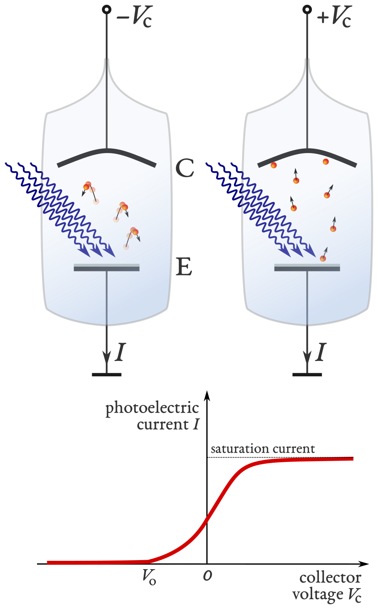

#+TITLE: Jan 26th Class Notes
#+AUTHOR: Ziky Zhang
#+OPTIONS: tex:t toc:nil
#+STARTUP: latexpreview
#+LATEX_HEADER: \setlength{\abovedisplayskip}{0pt}
#+LATEX_HEADER: \setlength{\belowdisplayskip}{0pt}
#+LATEX_HEADER: \usepackage[a4paper, margin=1in]{geometry}
* Topic: Wave-Particle duality
  - Light as particle
    - Photo electric effect
    - Atomic emission & absorption of light
    - Compton effect
  - Light as Wave
    - X-ray scattering from crystal
    - electron waves
* Photo Electric Effect
** significant
|-----------------+------+--------------|
| person          | year | significance |
|-----------------+------+--------------|
| Heinrich Hertz  | 1887 |              |
| Albert Einstein | 1921 | Nobel        |
| Robert Milliken | 1923 | Nobel        |
|-----------------+------+--------------|
** Experiment
#+ATTR_LATEX: :height 6cm

*** Voltage story
Regardless of brightness of light (intensity), if \(f < f_c\), \(V=0\), electrons don't move.
Regardless of brightness, if \(f > f_c\), V maxes out at some \(V_{stop}\).
\(f_c\) is the cut-off frequency of the metal used.
*** Current Story
Regardless of Intensity, if \(f < f_c\), \(I_{current} = 0\) forever.
Regardless of Intensity, if \(f > f_c\), \(I_{current}\) is readable within \(10^{-9} s\).
** Wave model of light
\(I_{intensity} = \frac{power}{area} = \frac{1}{2 \mu_0 c} |\overrightarrow{E_{0}}|^2 \)
\begin{align*}
\text{With }I_{intensity} &= 100 \frac{W}{m^2} \text{ light source, how much time does it take to diliver } 10\mathrm{eV} \text{ of energy to an area of } (0.1\mathrm{nm})^2 \\
I_{intensity} &= \frac{P}{A} = \frac{E}{t \cdot A} \\
t &= \frac{E}{I_{intensity} \cdot A} \\ \\
I_{intensity} &= 100 \frac{\mathrm{J}}{\mathrm{sm}^2} \\
t &= \frac{1.6 \times 10^{-19}\mathrm{sm}^2}{100 \mathrm{eV}} \cdot \frac{10 \mathrm{eV}}{(10^{-10} \mathrm{m})^2} \\
t &= 1.6 s
\end{align*}
** Theory of Photo Electric effect by Einstien
- Energy delivered by light happens in packets \(E_{packet} = h \cdot f \)
  \(h\) is the Planck's constant
- These packets are each a photon.
- One photon can liberate one electron.
- Different materials has different work function \((\Phi)\). Energy cost of losing an electron.
- \(KE_{\mathrm{max}} = \mathrm{eV_{\mathrm{stop}}}\)
** Energy Conservation
\begin{align*}
hf = KE_{\mathrm{max}} + \Phi \\
KE_{\mathrm{max}} = hf - \Phi &= \mathrm{eV_{stop}} \\
mx + b &= y
\end{align*}
#+ORGTBL: SEND salesfigures orgtbl-to-latex
|-------+--------|
| metal | ϕ (eV) |
|-------+--------|
| Na    |   2.28 |
| Pt    |   6.35 |
| Cu    |   4.70 |
|-------+--------|
* Atomic Emission & Absorption of Light
In a [[https://en.wikipedia.org/wiki/Gas-discharge_lamp][Gas discharge lamp]] with metal on both ends, a few atoms of a single elecment is placed inside the lamp. The two sides of lamp is hooked up to a AC power supply. When the power switches on, electrons get shoot out from the positive side of the lamp and sprint through the electric field created by the charge build-up. "The ions typically cover only a very short distance before colliding with neutral gas atoms, which give the ions their electrons. The atoms which lost an electron during the collisions ionize and speed toward the cathode while the ions which gained an electron during the collisions return to a lower energy state, releasing energy in the form of photons."
Observing the light from the lamp through a prism, light split into very specific blades of colors instead of a gradient of colors. Turns out, different atomic structures from different elements have different emission spectrum (finger print).
** The Bohr Model
[[https://en.wikipedia.org/wiki/File:Bohr_atom_animation_2.gif]] \\
The Bohr model successfully predicts finger print.
By Coulomb's Law:
\begin{align*}
F = \frac{1}{4 \pi \epsilon_0} \frac{e^2}{r^2} &= ma_{\mathrm{centripital}} \\
\frac{1}{8 \pi \epsilon_0} \frac{e^2}{r} &= \frac{mv^2}{2} \\
KE &= \frac{1}{8 \pi \epsilon_0} \frac{e^2}{r} \\ \\
U = - \frac{1}{4 \pi \epsilon_0} \frac{e^2}{r} &\qquad E = - \frac{1}{8 \pi \epsilon_0} \frac{e^2}{r}
\end{align*}
*** Stationary States
\(r \cdot mv = n \frac{h}{2 \pi} = n \hbar \text{, } n = 1, 2, 3, \dots\)
\begin{align*}
r \cdot mv &= n \frac{h}{2 \pi} = n \hbar \\
v &= \frac{nh}{2 \pi rm} = \frac{n \hbar}{rm} \\
v^2 &= (\frac{nh}{2 \pi rm})^2 = (\frac{n \hbar}{rm})^2 \\
\end{align*}

\begin{align*}
\frac{1}{8 \pi \epsilon_0} \frac{e^2}{r} &= \frac{mv^2}{2} \\
\frac{1}{8 \pi \epsilon_0} \frac{e^2}{r} &= \frac{m(\frac{n \hbar}{rm})^2}{2} \\
\frac{1}{8 \pi \epsilon_0} \frac{e^2}{r} &= \frac{m n^2 \hbar^2}{2 r^2m^2} \\
r &= \frac{8 \pi \epsilon_0 n^2 h^2 }{2 m e^2} \\
r_n &= (\frac{4 \pi \epsilon_0 \hbar^2}{me^2}) \cdot n^2 \\
a_0 = Bohr radius
\end{align*}

now replace \( r \) from the \(E\) equation:
\begin{align*}
E &= - \frac{1}{8 \pi \epsilon_0} \frac{e^2}{(\frac{4 \pi \epsilon_0 \hbar^2}{me^2}) \cdot n^2} \\
  &= - \frac{1}{8 \pi \epsilon_0} \frac{e^2me^2}{4 \pi \epsilon_0 \hbar^2 \cdot n^2} \\
  &= - \frac{me^4}{32 \pi^2 \epsilon_0^2 \hbar^2} \cdot \frac{1}{n^2} \simeq -13.6 \frac{eV}{n^2}
\end{align*}

\begin{align*}
E_1 &= -13.6 eV \\
E_2 &= -3.4 eV \\
E_3 &= -1.51 eV \\
E_4 &= -0.85 eV \\
\end{align*}
