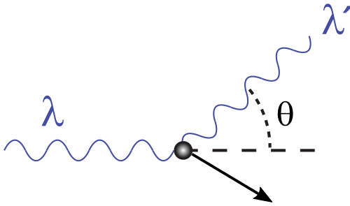

#+TITLE: Jan 27th Class Notes
#+AUTHOR: Ziky Zhang
#+OPTIONS: tex:t toc:nil
#+STARTUP: latexpreview
#+LATEX_HEADER: \setlength{\abovedisplayskip}{0pt}
#+LATEX_HEADER: \setlength{\belowdisplayskip}{0pt}
#+LATEX_HEADER: \usepackage[a4paper, margin=1in]{geometry}
Photoelectric Effect and H atom emission & absorption phenomeno successfully model of energy transitions associated with light.

#+Name: Compton Effect also solved with photon model
#+ATTR_LATEX: :height 4cm
#+ATTR_LATEX: :align center
 \\

Wave model predicts \(\lambda' = \lambda\) regardless of \( \theta \);
- the amplitude of outgooing wave is smaller than incoming wave.
The Wave model fails.

Arthur Compton used \(E_{\gamma} =hf\) & \(p_{\gamma} \frac{E_{\gamma}}{c} \) for photon incoming and outgoing
\( \lambda' - \lambda = \frac{h}{m_e c} (1 - \cos\theta)\)
Particle model predicts what is seen in experiment and matches experiment.
Divide both sides by \(c\).
\begin{align*}
\frac{1}{c}(\lambda' - \lambda) &= \frac{h}{m_ec} (1 - \cos \theta) \\
\text{take the equation from the wave model: }\frac{1}{f} = \frac{\lambda}{c} \\
\frac{1}{f'} - \frac{1}{f} &= \frac{h}{m_e c}(1 - \cos \theta)
\end{align*}
\(\frac{h}{m_e c} = 0.002426 \mathrm{nm}\) is what refers to as Compton wavelength.
\(\frac{hc}{m_e c^2} = \frac{1240 \mathrm{eV \cdot nm}}{.511 \mathrm{MeV}}\)

Light still does behave like a wave
But particles are acting like waves as well.
- Bounce off of crystals
- Travel through small openings
Louis de Broglie assigned wavelength of particles in his PhD thesis, later on become a Nobel prize winning piece of thesis \( \lambda = \frac{h}{P} \), where \( P \) is the quantitatively leads to the correct differaction and interference patterns.
