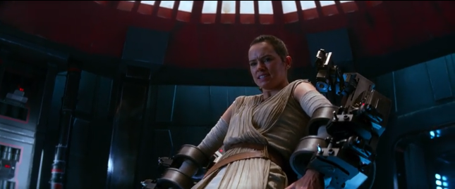
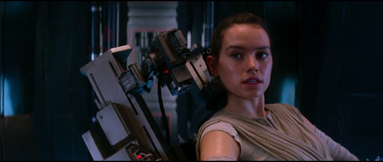

in the movie Star Wars: The Force Awakens, from 1:30:01 to 1:31:22 used some tight camera angles to illustrate Rey using jedi mind trick to make one of the storm trooper to release her from the interrogation room right before the Kylo Ren comes back and realize that she is gone.
in the short 80 seconds, the director used several tricks to intensify the scene and shows the power of Rey. here is how, in the first few second, low angle shots bind with cold spotlight hitting on Rey to express her struggle and will to escape but using pure physical power isn't enough; soon, camera slides through the background for a short but yet memorable moment where we see one singular storm trooper in the interrogation room and swiftly slides back to Rey's face with a thinking cap on. She started speaking to storm trooper, to release her from the spot not by helpless begs but instead commands directly to the storm trooper, though still breathing heavily. for a short while, the camera focus changed towards the storm trooper who really does have the power to do as he wish at the moment closing up to her and question her commands. a shot raise from below of Kylo Ren approaching the interrogation room once again, raise up the tension in the room and left Rey not much more time. the shot came back to her but this time, her breath starts to steady down and eyes starting to look definite, she gave her command one more time with a way more confident and steady mind trick, storm trooper obeyed. even after the release, she was in disbelief for a short while with quite a confusing look on her face but realizing time isn't waiting for her, Kylo Ren also, she commands the storm troopers one more time, i think she does that mostly just to solidify to herself that she was indeed, was able to control the storm trooper. and finally she ran away just before Kylo Ren enters the room found nothing but a empty chair, the camera shakes for some degree with the music representing Kylo ren's internal surprised for her escape.

https://youtu.be/Xithigfg7dA?si=6GF2TcdZoUKkiJOc
the movie series deadpool is famous for breaking the forth wall and constantly remind the audience that "yes, this is a movie, and yes, i know you are watching. and by the way, that joke i just made was funny, so laugh", though there are shots in the movies with intense action scenes where invisibility kind of comes into play, but before you are in too deep, deadpool will say something that make you realize again, "oh yeah, it's a movie".

