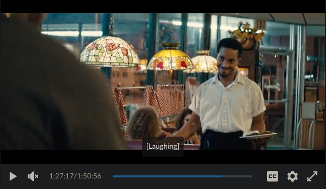
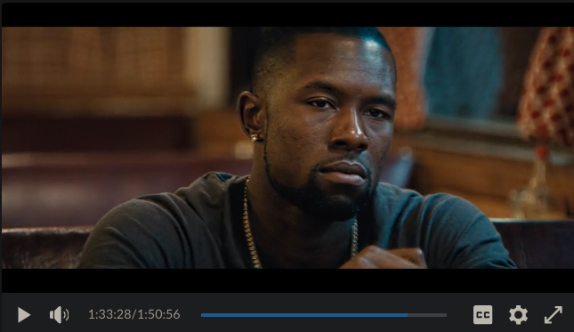

in the movie Moonlight, from 1:27:11 to 1:36:044(sorry, this is a bit of a long scene and the same shot stretch for quite long), a quiet but powerful scene takes place in a small diner where Kevin serves Chiron not just a meal but a peace offering. this short five-minute moment shifts the whole emotional temperature of the film and lets two characters who’ve been holding so much finally start letting some of it out

at first the diner comes across as just another casual spot with background chatter and clinking dishes. people are eating, the lights feel real and steady, everything feels lived in and unremarkable. but as the conversation between Chiron and Kevin starts to deepen, the director slowly pulls us away from that realism of having crowd in the restaurant. the editing becomes tighter, less concerned with the space
and more with the faces. background movement stays but we stop noticing it, the frame begins to feel closed in like it belongs only to them.
the lighting begins to shift without making a show of it. golden tones fill the space with a warmth that softens the hard surfaces of the diner. it is subtle but intentional, as if the room itself is leaning in closer, listening. the shadows become softer and less defined. this creates a sense of safety that allows vulnerability to show itself. the camera holds longer on faces and does not cut unless it needs to. silence is left uncut and the pacing of edits slows down to match the weight of what is not being said.
Chiron is lit with just enough glow to reveal the small changes in his expression. even as he speaks quietly and rarely looks up, the camera invites us to watch every flicker of doubt and effort. Kevin’s side is more exposed, more steady in the light, giving the impression of someone who is grounded and ready to receive.
when Chiron finally speaks openly, the film resists the temptation to swell with music or shift its tone. the moment lands because of the stillness. there is no cue telling us what to feel, just light, silence, and a frame that refuses to look away.

