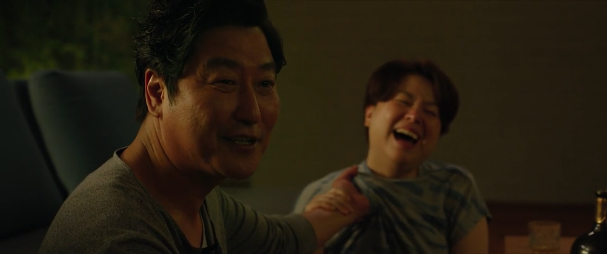
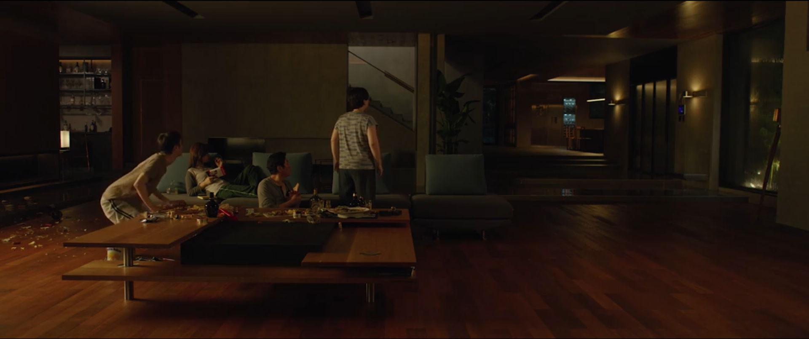

in parasite (2019), there’s this stretch from about 1:02:10 to 1:04:00 that really sticks with me. it’s the scene where the Kim family, thinking the parks are away, just takes over the living room, eating, drinking, sprawled out on the fancy furniture like they own the place. the rain is pounding outside. inside, it’s all glass and wood and expensive emptiness. for a moment, it almost feels like the Kims belong. but the film never lets you forget they don’t.

the way Bong Joon-ho uses the setting here is genius. the camera starts wide, showing the Kims scattered across the huge room, looking small and out of place. the mise-en-scène is so intentional: half-eaten food, spilled drinks, bodies draped over the couch. it’s messy, but the mess feels wrong. like it doesn’t belong in this perfect house. the lighting is soft but not warm. it’s like the house is tolerating them, not welcoming them. you get these shots that make the Kims look like they’re playing house in someone else’s life.

as they get more comfortable, the camera moves in. but there’s always this tension. the editing slows down, letting the awkwardness breathe. you hear the rain. the clinking of glasses. their voices echoing in the big room. there’s no music. just the storm and the sounds of the Kims pretending. it’s almost funny. but it’s also tense. because you know this can’t last. the house feels like it’s watching. waiting for them to slip up.

what really gets me is how the setting does so much of the storytelling. the parks’ house is beautiful. but it’s also a fortress. the glass walls let you see everything. but they also make you feel exposed. the Kims are inside. but they’re never really safe. the way they move through the space, lounging, laughing, even bickering, feels like a rehearsal for a life they’ll never actually have. the house is both a prize and a reminder of what they don’t have.

this scene is a perfect example of how setting isn’t just a backdrop. it’s the engine of the narrative. Bong Joon-ho doesn’t need to spell out the class divide. you can see it in every frame. for a couple of minutes, you get to feel the tension and the longing right along with the Kims. then reality comes crashing back in.

