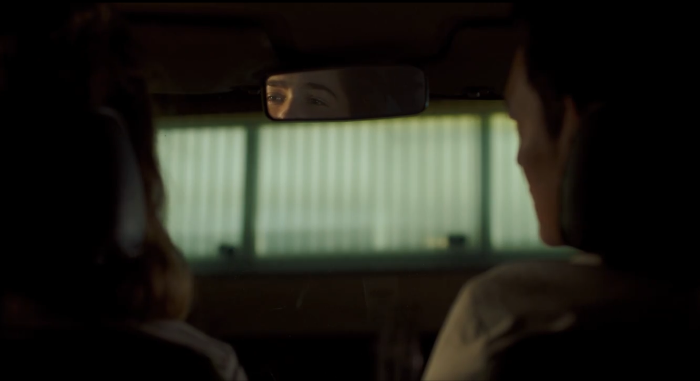
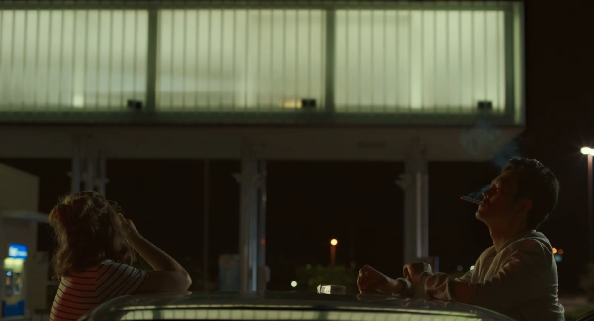

in Columbus (2017), the scene from 0:44:03 to 0:47:30, where Casey and Jin sit in the car, talk, and then climb onto the roof for a smoke. does a lot with very little, letting design and lighting do the heavy lifting.

the first part is inside the car, shot from the back seat. the camera just sits there, not moving, almost like a third passenger. you see the back of Casey’s head and a partial profile of Jin. the lighting is super soft, almost like the world outside is pressing in but can’t quite get through. the only sharp thing is the rearview mirror, which catches Casey’s eye, she’s looking, but it’s not clear if it’s at Jin or just out into the night. it’s a small thing, but it makes the whole space feel private, like a bubble, but also tense. the greenish stripes outside (maybe a fence or wall) add a weird kind of depth, almost abstract, and remind you that these characters are surrounded by architecture even when they’re not talking about it.
when they move onto the roof, everything opens up. now it’s just them, the night, and this big glowing structure in the background. the lighting shifts: it’s still soft, but now the world feels bigger and emptier. Jin lights his cigarette, the smoke curling up in the dark, and for a moment it’s like time slows down. the glow from the building behind them is gentle, not harsh, and it makes their silhouettes pop without making them look heroic or dramatic. it just feels honest, two people who don’t know what to say but need to be there anyway. the cigarette becomes a prop that’s not just about smoking, but about filling silence and giving their hands something to do when words run out.

compared to something like Star Wars: the Force Awakens we watched earlier this semester (which is all about big gestures, bright colors, and flashy effects), Columbus is quiet. Kogonada lets the spaces breathe. the design is all about restraint: negative space, soft light, real architecture. it’s like the film is asking you to notice the little things—the way light falls, the way a room frames a person, the way silence can say more than dialogue.
recently, i watched Past Lives (2023), and it gave me a similar feeling. the way it uses city settings, muted colors, and small gestures to show longing and distance really stuck with me. both films trust the audience to fill in the gaps.
https://youtu.be/4l5rHXYxU7M?si=U2nWvnQKZ4WfK4pP
