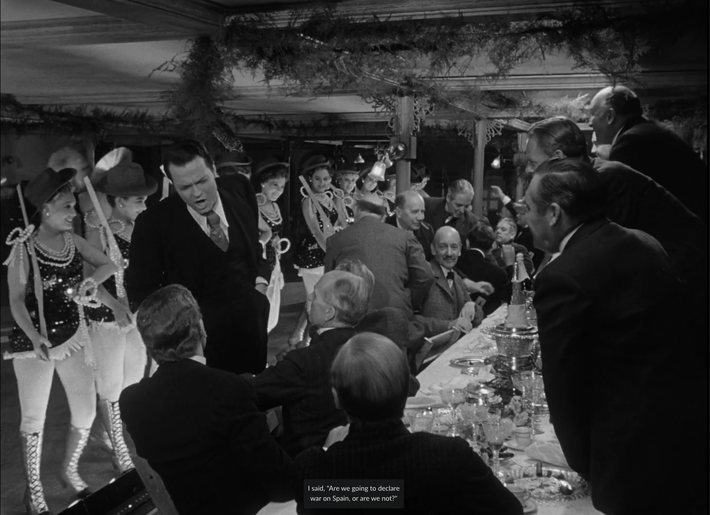
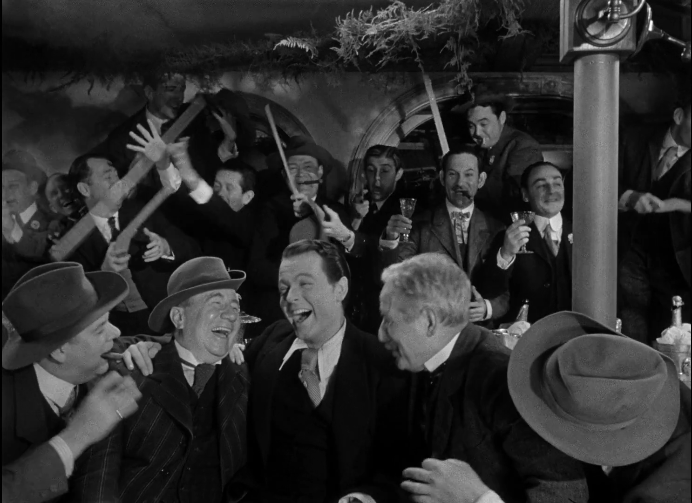

in Citizen Kane that starts at 41:00 and runs through 45:00, where the ladies are dancing in the parlor and the gentlemen are gathered around the table, eating and talking. this sequence is a great example of how composition and mise-en-scene work together to shape our experience of the film’s world and its characters.

right away, the composition stands out for its use of deep space. the frame is packed with visual information: in the foreground, the men are seated, their faces half lit by the glow of the table lamps, while in the background, the women swirl around in a dance, their movement almost ghostly. this arrangement isn’t just pretty to look at. it’s doing real narrative work. the separation of the men and women into different planes of the frame visually reinforces the social and emotional distance between them. Kane himself is often positioned at the head of the table, dominating the left or center third of the frame, which draws our eye and signals his authority, but also his isolation. the rule of thirds is at play here, balancing the busy, lively background with the more static, tense foreground.

the lighting is classic gregg toland: high contrast, with deep shadows that carve out the space and give it a sense of depth and unease. the women’s white dresses catch the light, making them almost spectral, while the men’s darker suits blend into the shadows. this contrast not only separates the two groups visually, but also hints at the emotional coldness and disconnect that’s growing in Kane’s world. the set design, with its ornate furnishings and heavy drapes, adds to the feeling of claustrophobia, there’s a sense that everyone is trapped in their roles, performing for each other.

what’s really cool is how this scene subverts hollywood conventions. instead of using quick cuts or close ups to focus on individual emotions, welles and toland let the camera linger in wide shots, forcing us to take in the whole tableau. it’s almost theatrical, but the effect is cinematic: we’re made to feel like observers, noticing the distance and tension that words alone can’t express. the invisible style is still there, nothing feels showy or artificial, but the composition quietly shapes how we understand the characters’ relationships and the world they inhabit. it’s a masterclass in how mise-en-scene can communicate mood and meaning without forcing a single line of dialogue.

