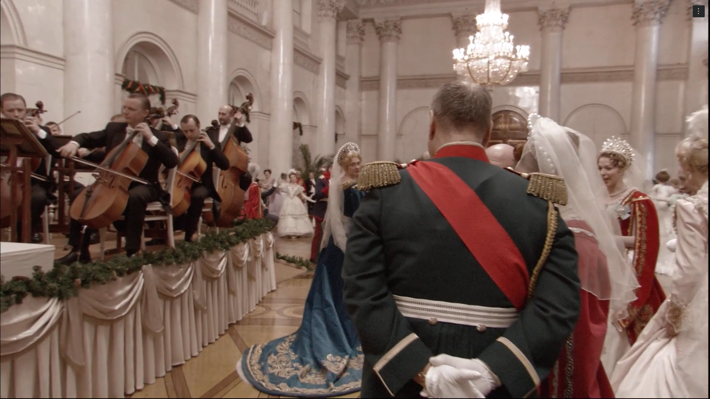
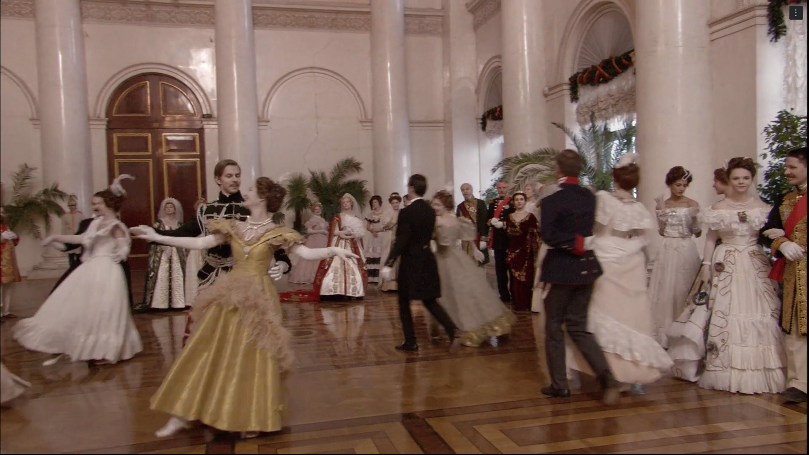

in Russian Ark, the grand ball scene in the winter palace from 1::15:43 to 1:18:41 (but really the whole scece from 1:14:44 to 1:25:20) stands out even knowing ahead of time that the entire film is one continuous shot. watching the camera float through the ballroom, past dancers, and guests in shimmering gowns. i kept thinking about the sheer scale and precision involved. every movement, every cue, every swirl of a dress or turn of the camera had to be perfect, because there was never going to be a cut to hide behind. it’s honestly hard not to feel a kind of awe at the way the scene unfolds in real time, with hundreds of people and live music all choreographed to flow seamlessly together.

what grabs me most is how the lack of editing changes the way we experience the scene. there’s no quick cut to a reaction shot, no switching perspectives. the camera just moves, sometimes drifting with a group, sometimes pausing to catch a detail, sometimes spinning with the dancers. it feels less like watching a movie and more like moving through a memory or a dream. the way the camera moves makes you hyper aware of the space, the scale, and the energy in the room. you see the choreography not just of the dancers, but of everyone: the guests, the musicians, even the camera crew, who are invisible but everywhere at once. the steadicam work is so smooth it’s almost unreal, but it never feels cold or mechanical. instead, it’s intimate, you’re right there, breathing in the music and the movement.

the continuous shot makes the whole thing feel alive and unpredictable, like anything could happen and you’d see it as it unfolds. it’s a reminder of how rare it is for a film to let you just exist in a moment, without interruption. Russian Ark’s form isn’t just a technical stunt; it actually changes how you understand the scene. history feels continuous, not chopped up. you’re not just observing, you’re participating, wandering through time.

for a different take on the long shot, the battlefield run from 1917 (https://www.youtube.com/watch?v=cwUzUzpG8aM) uses the same “one take” technique, but the effect is totally different. here, the camera sprints with the main character through chaos and explosions, never letting you look away or catch your breath. it’s tense, relentless, and claustrophobic, the opposite of Russian Ark’s dreamy flow. both films use the long take to pull you in, but where Russian Ark invites you to drift, 1917 forces you to run for your life.