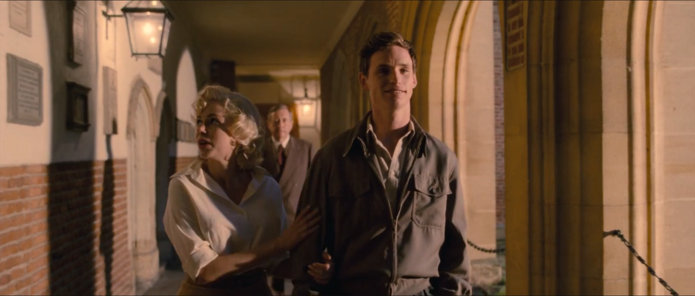
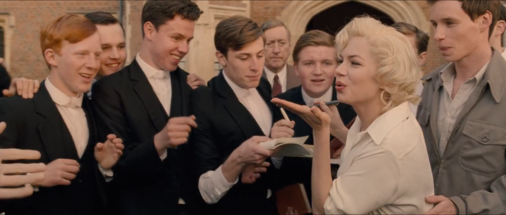

in My Week With Marilyn, the scene from 01:01:14 to 01:02:29 where Marilyn visits a school with colin and the students catch sight of her, turns what could be a simple cameo into a lesson in how film style can shape the way we perceive acting. the moment Marilyn steps into the hallway, the whole energy of the film shifts. the camera pulls back just enough to show the crowd, but it never lets us forget who the center of gravity is. students’ heads pop up, whispers ripple, and there’s this sudden, electric sense of anticipation. the shot composition keeps Marilyn right in the middle, almost swallowed by the crowd but also somehow floating above it, a visual way of saying she’s both part of the world and apart from it.

the lighting is especially clever here. natural light pours through the windows, but it seems to find Marilyn and cling to her, softening her features and giving her skin that signature glow. but it’s not overdone, there’s no spotlight or golden haze, but pcompared to the students and the drab school interior, Marilyn looks like she’s stepped out of another reality. the students are kept a little more in shadow, their faces blurred or half lit, which makes their excitement feel less like individual reactions and more like a collective wave. it’s as if she’s not just a person but an event.

what’s cool is how Williams plays the moment. she gives us the “Marilyn” everyone expects: smiling, waving, a little flirtatious, but the camera catches the cracks: a flicker of nerves, a quick glance at Colin, the way her shoulders tense as the crowd closes in. the handheld camera work adds to the feeling that things are teetering on the edge of chaos. it’s not just about being seen but about being overwhelmed by being seen. the editing lets shots linger on her face just long enough for us to notice the shift from performance to vulnerability and back again.

the scene works because the cinematography and lighting doesn’t just decorate Williams’s performance, they interrogate it. they push us to see both the myth and the human being, sometimes in the same frame. it’s a reminder that in film, acting isn’t just what the actor does, but what the camera and the light allow us to see.

[[https://youtu.be/GVDpmiKPWJU?si=-fFNxjbYytft0E73][A MILLION DREAMS FROM THE GREATEST SHOWMAN]]

for the second part, i want to talk about a scene from the Greatest Showman, which is honestly my favorite musical. in this youtube clip where Michelle Williams and Hugh Jackman perform “A Million Dreams.” the cinematography here is just beautiful as a film piece. the camera glides smoothly through the space as the song builds, never distracting but always drawing us in. the lighting is warm and golden, filling the room with a sense of hope and possibility, which matches the theme of the song. Williams’s performance feels naturalistic and honest. she’s not just singing, she’s living the moment, and the camera lets us see her character’s quiet conviction and support for PT. every movement and glance is captured with care, and the smoothness of the shots makes it feel like we’re floating along with their dreams. it’s one of those rare moments where the style of the film and the heart of the performance work perfectly together.
