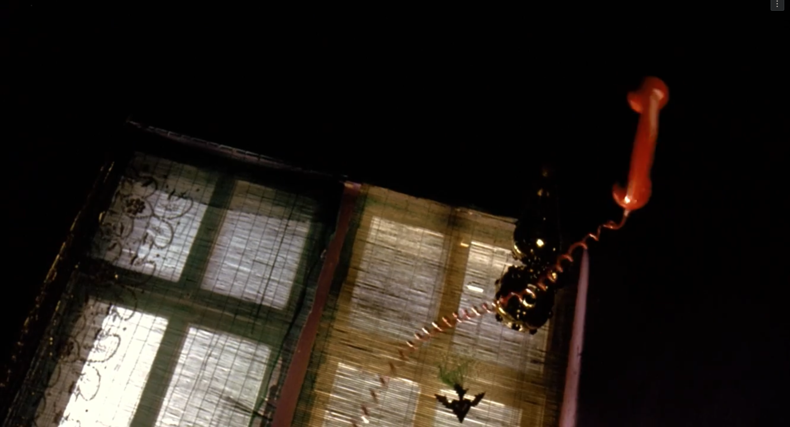
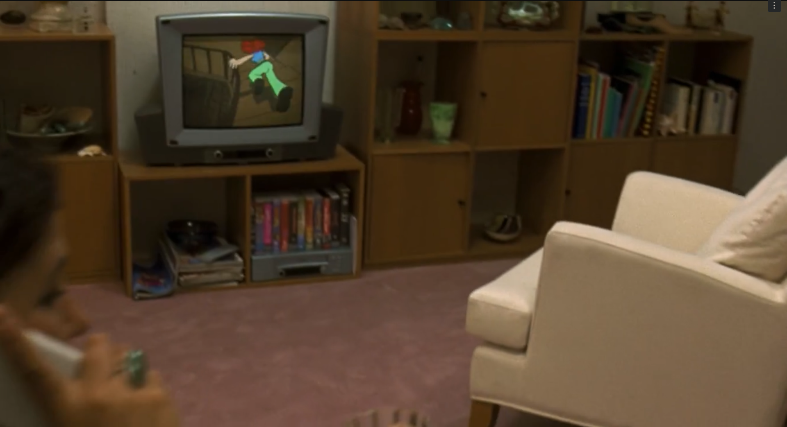

in Run Lola Run, the sequence right after the phone call (00:11:43–00:13:07) is one of those moments where editing isn’t just about moving the story along, it’s the story’s heartbeat. Lola hangs up, and suddenly the whole world seems to tilt with her urgency. the shots fragment her actions: close up on her hand slamming the phone, her keys snatched up, the door flung open. each cut is like a drumbeat, and none of these shots last long enough for us to settle. it’s not just showing us she’s in a hurry, it’s making us feel it. every second counts, and the editing makes sure we know it.

what really stands out is how the film slips into animation as Lola barrels down the spiraling stairwell. the live action suddenly gives way to a hand drawn, hyper stylized version of her sprint. it’s jarring, but in a way that fits perfectly: the animation exaggerates her speed and the chaos of her mind, letting us feel her panic and determination in a way that realism alone couldn’t pull off. it’s like the film is saying, “this is bigger than life right now,” and the editing just runs with it.

the transitions between shots are so smooth you almost don’t notice how wild the sequence is. there’s this moment where Lola bursts out onto the street, the camera follows her, and the edit slips from animation back to live action without missing a beat. the rhythm never breaks. the shots jump between her face, her feet, the city around her, sometimes from her point of view, sometimes not. it fragments space and time, but somehow it all adds up. the editing uses juxtaposition and pace to pull us inside Lola’s headspace: the world blurs, and all that matters is forward motion.

this isn’t conventional continuity editing that wants to stay invisible. here, the cuts, the animated break, the relentless pace they’re all front and center. the editing is the emotional engine, and for these 90 seconds, it’s like we’re running right alongside Lola, feeling every pulse and pivot she makes.
