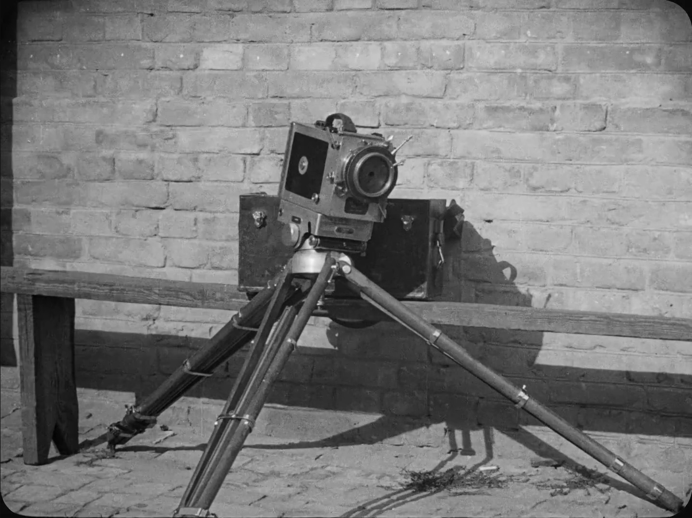
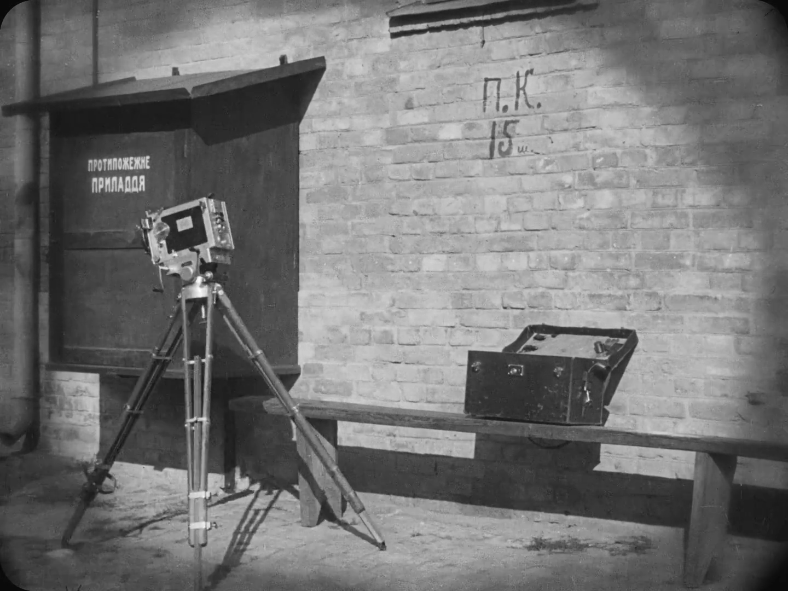

in Man With a Movie Camera, there’s a short sequence towards the end from about 01:00:36 to 01:01:36 that sticked out to me. the camera itself, just a tripod and lens, no operator comes to life in a stop motion flurry. first, the tripod legs jerk and shuffle as if they’re waking up. the camera head tilts, the whole contraption stands up straight, and then, with a kind of mechanical pride, it “walks” off screen. it’s weirdly charming, almost like watching the robot dog from Boston Dynamics figure out its body for the first time.

this scene is a perfect example of discontinuity editing that refuses to hide its tricks. every movement is made from a series of jumpy, hand animated frames. there’s no attempt to smooth over the motion or make the camera seem “real”. instead, each cut is abrupt, the positions shift in space and time, and the normal rules of continuity are tossed out. the 180 degree rule doesn’t matter here, the camera’s orientation flips and resets with no warning. screen direction is meaningless. the editing isn’t trying to make us forget we’re watching a movie, it’s making sure we notice every bit of the process.

the effect is playful but also kind of radical. by animating the camera, Vertov is basically saying, “look, this is how movies are made by people, with machines, and with a lot of clever editing.” it turns the camera into a character, and in doing so, it makes the filmmaking process visible. the stop motion makes us aware of time being manipulated, of space being broken up and reassembled. it’s not about creating a seamless world, but about reminding us that film can do things reality can’t.

watching this, i can’t help but think about how much we take “invisible” editing for granted. most movies want us to forget the camera exists. here, Vertov wants us to see it, to think about it, and maybe even laugh at it. it’s a moment where the film steps out of documentary mode and becomes a celebration of cinema itself messy, experimental, and alive.
