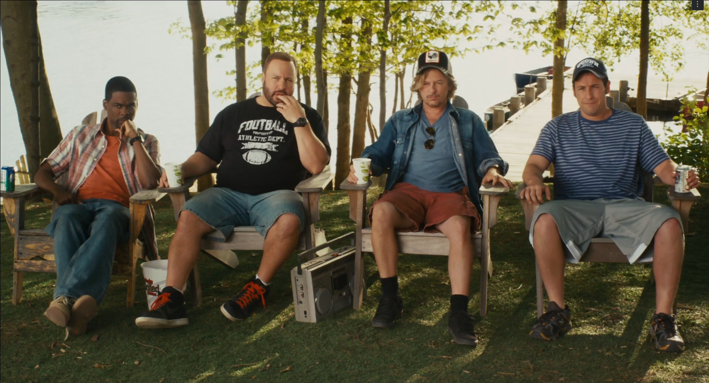

in Brainwashed: Sex-Camera-Power, from 57:24 to 57:44, Nina Menkes uses a short scene from Grown Ups (2010), to break down exactly how hollywood comedies normalize the sexualization of women through camera work. in this moment, a woman tries to fix a car while a group of men and boys gather, openly ogling her. it’s a joke in the film, but Menkes pauses the scene and draws our attention to the way the camera becomes complicit: instead of focusing on the woman’s actions or personality, it lingers on her body, aligning our gaze with the male characters’. the humor depends on this visual setup—her presence is reduced to something for others to look at, not someone with agency or purpose.

Menkes’s analysis in brainwashed is effective because it doesn’t just describe the problem; it shows it in action. by freezing the frame and highlighting the composition, she reveals how the camera’s choices, angle, duration, framing, turn the woman into an object, not a subject. this isn’t just about one movie: it’s a pattern across decades of hollywood films, and Brainwashed uses Grown Ups as a clear, modern example. after seeing Menkes dissect this scene, it’s hard not to notice how often comedies, especially, rely on these “harmless” moments of objectification for laughs. the normalization is so deep that the audience is expected to join in without question.

to connect this to another film, i picked the Lady Lisa scenes from Pixels (2015) as my youtube example: https://youtu.be/lxpvxLB4ASc?si=sW-rTEggAh2Vqw-V. Lady Lisa is constructed almost entirely as an object of male fantasy, she barely speaks, and the camera frames her with slow tracking shots and soft lighting that emphasize her sexuality over any sense of character. it’s the same visual logic Menkes critiques: the woman is there to be looked at, not to act or decide.

Brainwashed: Sex-Camera-Power made me rethink how much camera style shapes our understanding of gender in movies. Menkes’s use of Grown Ups is especially powerful because it takes a throwaway joke and reveals how it’s actually a small part of a much larger system that teaches us, over and over, to see women as objects.
