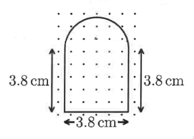
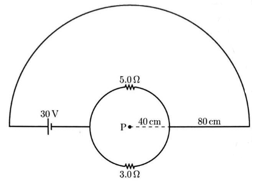

#+TITLE: Worksheet #5
#+AUTHOR: Ziky Zhang
#+OPTIONS: tex:t toc:nil
#+STARTUP: latexpreview
#+LATEX_HEADER: \setlength{\abovedisplayskip}{0pt}
#+LATEX_HEADER: \setlength{\belowdisplayskip}{0pt}
#+LATEX_HEADER: \usepackage[a4paper, margin=1in]{geometry}
1. non-conducting rod is bent into the shape of a circle of radius \( \mathrm{R} \) centered at the origin of an \( \mathrm{x  y} \) coordinate system. The linear charge density is not uniform, but instead varies according to
   \[\lambda = -\lambda_0 \cos(\theta)\],
where \( \lambda_0 \) is a positive constant and \( 0 \) is the angle measured counter-clockwise relative to the \( +x \) direction.
   1. Draw a picture of this situation, and indicate on that picture which parts of the rod are positively charged and which parts (if any) are negatively charged. What is the total charge on the rod?
   2. Calculate the electric field at the origin.
      
2. A loop of wire, consisting of a semi-circle and \( 3 \) sides of a \( 3.8 \ \mathrm{cm} \times 3.8 \ \mathrm{cm} \) square, is placed in a region of space where a uniform magnetic field directed out of the page is increasing in magnitude at a constant rate of \( 2.6 \ \mathrm{T/s} \), as shown below.
   #+ATTR_LATEX: :height 3cm
   #+CAPTION: 
   #+LABEL: Figure exam3.2
   
   1. What is the induced emf in the circuit? In what direction is the emf?
   2. If the total resistance of the wire is \( 0.056 \ \Omega \), how much power is dissipated by the resistance of the loop?

3. Calculate the magnetic field at \( \mathrm{P} \), located at the center of the circular wires in the circuit below.
   #+ATTR_LATEX: :height 3cm
   #+CAPTION: A circuit consist of a circular loop with radius of \( 40 \ \mathrm{cm} \) from \( \mathrm{P} \) with \( 5.0 \Omega \) resistor on the top of the loop and the 
   #+LABEL: Figure exam3.3
   

\begin{align*}
\begin{aligned}[t]
30 \mathrm{V} - 3 \Omega \cdot I_{\mathrm{bot}} &= 0 \\
30 \mathrm{V} \cdot \frac{1}{3 \Omega} &= I_{\mathrm{bot}} \\
I_{\mathrm{bot}} &= 10 \mathrm{A}
\end{aligned}
\quad
\begin{aligned}[t]
30 \mathrm{V} - 5 \Omega \cdot I_{\mathrm{mid}} &= 0 \\
30 \mathrm{V} \cdot \frac{1}{5 \Omega} &= I_{\mathrm{mid}} \\
I_{\mathrm{mid}} &= 6 \mathrm{A}
\end{aligned}
\quad
\begin{aligned}[t]
I_{\mathrm{top}} &= I_{\mathrm{mid}} + I_{\mathrm{bot}} \\
&= 10 \mathrm{A} + 6 \mathrm{A} \\
&= 16 \mathrm{A}
\end{aligned}
\end{align*}

\begin{align*}
\begin{aligned}[t]
B_{\mathrm{top}} &= \frac{\mu_0 I_{\mathrm{top}} \phi}{4 \pi R} \\
  &= \frac{(4 \pi \times 10^{-7} \frac{H}{m}) \ (16 \mathrm{A}) \ (\pi)}{(4 \pi) \ (40 \mathrm{cm} + 80 \mathrm{cm})} \\
  &= \frac{64 \pi \mathrm{AH}}{1.20 \mathrm{m^2}} \times 10^{-7} \\
  &= \frac{16 \pi \mathrm{AH}}{0.30 \mathrm{m^2}} \times 10^{-7} \\
  &= 5.33 \pi \times 10^{-6} \ \mathrm{T} \text{ in to page} \\
\end{aligned}
\qquad
\begin{aligned}[t]
B_{\mathrm{bot}} &= \frac{\mu_0 I_{\mathrm{bot}} \phi}{4 \pi R} \\
  &= \frac{(4 \pi \times 10^{-7} \frac{H}{m}) \ (10 \mathrm{A}) \ (\pi)}{(4 \pi) \ (40 \mathrm{cm})} \\
  &= \frac{\pi \mathrm{AH}}{0.4 \mathrm{m^{2}}} \times 10^{-7}\\
  &= \frac{1.25 \pi \mathrm{AH}}{\mathrm{m^{2}}} \times 10^{-7}\\
  &= 1.25 \pi \times 10^{-7} \ \mathrm{T} \text{ in to page} \\
\end{aligned}
\qquad
\begin{aligned}[t]
B_{\mathrm{mid}} &= \frac{\mu_0 I_{\mathrm{mid}} \phi}{4 \pi R} \\
  &= \frac{(4 \pi \times 10^{-7} \frac{H}{m}) \ (6 \mathrm{A}) \ (\pi)}{(4 \pi) \ (40 \mathrm{cm})} \\
  &= \frac{3 \pi \mathrm{AH}}{0.2 \mathrm{m^{2}}} \times 10^{-7}\\
  &= \frac{1.5 \pi \mathrm{AH}}{\mathrm{m^{2}}} \times 10^{-7} \\
  &= 1.5 \pi \times 10^{-7} \ \mathrm{T} \text{ out of page} \\
\end{aligned}
\end{align*}

\begin{align*}
B_{\mathrm{total}} &= B_{\mathrm{top}} + B_{\mathrm{mid}} + B_{\mathrm{bot}} \\
  &= 5.317 \times 10^{-6} T \text{ in to page}
\end{align*}
