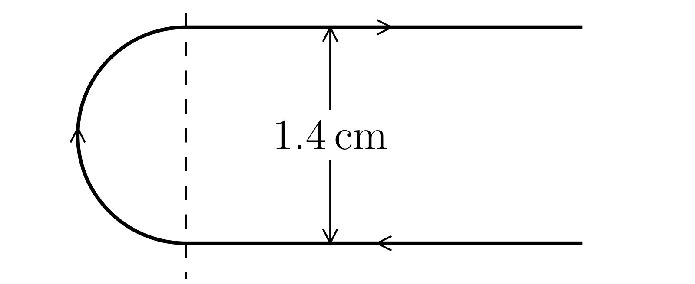

#+TITLE: Electromagnetism Notes
#+AUTHOR: Ziky Zhang
#+OPTIONS: tex:t
#+STARTUP: latexpreview
#+LATEX_HEADER: \setlength{\abovedisplayskip}{0pt}
#+LATEX_HEADER: \setlength{\belowdisplayskip}{0pt}
#+LATEX_HEADER: \usepackage[a4paper, margin=1in]{geometry}
#+LATEX_HEADER: \usepackage{multicol}
#+LATEX_HEADER: \setlength{\columnsep}{1cm}

\newpage
* Coulomb's Law

\begin{multicols}{2}

\textbf{Charge}, often denoted as $q$. There are two types of charges: positive ($+$) and negative ($-$). \\
Charges of the \underline{same sign repel}, while \underline{opposite signs attract}. \\ \\
Everyday object normally stays neutrually charged, which means that the positively charged particles and negatively charged particles balance out. When this balance breaks, the obkect becomes either positively charged or negatively charged.

\columnbreak

\includegraphics[width=0.9\columnwidth]{./notesImg/1.1.jpg}
\captionof{figure}{Two point charges illustrating attraction and repulsion}

\end{multicols}

* 

#+ATTR_LATEX: :environment multicol :options 2
#+BEGIN_multicol

these are all garbage

#+ATTR_LATEX: :width 0.9\columnwidth
#+CAPTION: Two point charges hi illustrating attraction and repulsion

#+END_multicol
