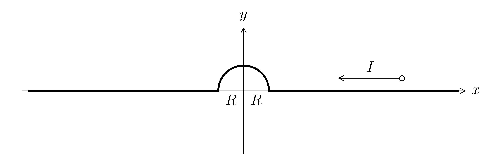
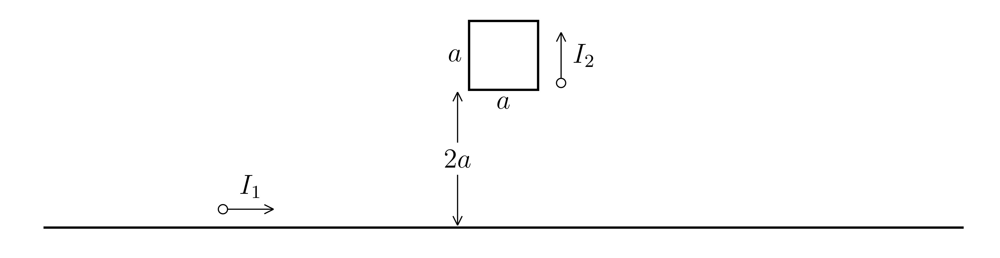

#+TITLE: Worksheet #11
#+AUTHOR: Ziky Zhang
#+OPTIONS: tex:t toc:nil
#+STARTUP: latexpreview
#+LATEX_HEADER: \setlength{\abovedisplayskip}{0pt}
#+LATEX_HEADER: \setlength{\belowdisplayskip}{0pt}
#+LATEX_HEADER: \usepackage[a4paper, margin=1in]{geometry}
1. A certain magnet placed at the origin produces a magnetic field whose value at all points in the \( x \text{-} y \) plane is given by \( \vec B = \frac{\alpha}{r^3} (-\vec k) \), where \( r = \sqrt{x^2+y^2} \) and \( \alpha \) is a constant which depends on the strength of the magnet. An infinite wire lying entirely in the \( x \text{-} y \) plane is shown below.
   #+ATTR_LATEX: :height 3cm
   #+CAPTION: Infinite wire in x-y plane
   #+LABEL: Figure 11.1
   
   Calculate the net magnetic force acting on the entire wire. (Hint: do separate calculations for each section of the wire). The field is uniform over the semi-circular part, but is not uniform over the straight sections.

2. A square loop of side length a is located a distance \( 2a \) from an infinite straight wire. Both the loop and the infinite wire carry a current as shown below.
   #+ATTR_LATEX: :height 3cm
   #+CAPTION: A square loop and a long straight wire
   #+LABEL: Figure 11.2
   
   1. Calculate the net force acting on the square loop due to the field produced by the infinite wire.
   2. Calculate the net force acting on the left side by itself of the square loop due to the field produced by the infinite wire. Why did you not have to do this calculation in order to answer part a?

\newpage
1. 
\begin{align*}
\begin{aligned}[t]
dF_{\mathrm{right}} &= i \ d \vec{L} \times \vec{B} \\
 F_{\mathrm{right}} &= \int^{\infty}_{R} i dr (-\hat{x}) \times \frac{\alpha}{r^{3}}(-\hat{z}) \\
 &= \int^{\infty}_{R} \frac{i \alpha}{ r^{3}} (-\hat{y}) \ dr \\
 &= i \alpha (-\hat{y}) \int^{\infty}_{R} \frac{1}{ r^{3}} \ dr \\
 &= i \alpha \frac{1}{2r^2} (-\hat{y}) \bigg|^{\infty}_{R}
\end{aligned}
\qquad
\begin{aligned}[t]
F_{\mathrm{semi\text{-}circle}} &= i \ \vec{L} \times \vec{B} \\
&= i \ \frac{1}{2} 2 \pi \mathrm{r} \cdot \frac{\alpha}{r^3} \\
&= \frac{i \pi \alpha}{\mathrm{r}^2} \\
\end{aligned}
\end{align*}

2.(a)
\begin{align*}
\begin{aligned}[b]
B_{\mathrm{I}_1} &= \frac{\mu_0 i}{2 \pi R} = \frac{\mu_0 i_1 }{2 \pi R} \\
\\
\overrightarrow{F_{\mathrm{left}}} &= i\ d\vec{L} \times \vec{B} \\
  &= I_2 \ a \frac{\mu_0 I_1 }{2 \pi } \cdot (-\hat{\jmath} \times \hat{z}) \cdot \int^{2a}_{3a} \frac{1}{r} dr \\
  &= I_2 \ \frac{\mu_0 I_1 }{2 \pi } \ln \bigg(\frac{2}{3} \bigg) (-\hat{\imath}) \\
  &= \frac{\mu_0 I_1 I_2}{2 \pi } \ln \bigg(\frac{2}{3} \bigg) (-\hat{\imath})
\end{aligned}
\qquad
\begin{aligned}[b]
\overrightarrow{F_{\mathrm{right}}} &= i\ d\vec{L} \times \vec{B} \\
  &= I_2 \ a \frac{\mu_0 I_1 }{2 \pi } \cdot (\hat{\jmath} \times \hat{z}) \cdot \int^{2a}_{3a} \frac{1}{r} dr \\
  &= I_2 \ \frac{\mu_0 I_1 }{2 \pi } \ln \bigg(\frac{2}{3} \bigg) (\hat{\imath}) \\
  &= \frac{\mu_0 I_1 I_2}{2 \pi } \ln \bigg(\frac{2}{3} \bigg) (\hat{\imath})
\end{aligned}
\end{align*}
\begin{align*}
\begin{aligned}[t]
\overrightarrow{F_{\mathrm{top}}} &= i\ d\vec{L} \times \vec{B} \\
  &= I_2 \ a \frac{\mu_0 I_1 }{2 \pi \cdot 3a} \cdot (-\hat{\imath} \times \hat{z})\\
  &= \frac{\mu_0 I_1 I_2}{6 \pi } ({\hat{\jmath}}) \\
\end{aligned}
\qquad
\begin{aligned}[t]
\overrightarrow{F_{\mathrm{bottom}}} &= i\ d\vec{L} \times \vec{B} \\
  &= I_2 \ a \frac{\mu_0 I_1 }{2 \pi \cdot 2a} \cdot (\hat{\imath} \times \hat{z})\\
  &= \frac{\mu_0 I_1 I_2}{4 \pi } ({- \hat{\jmath}}) \\
\end{aligned}
\end{align*}

\begin{align*}
\overrightarrow{F_{\mathrm{net}}} &= \overrightarrow{F_{\mathrm{left}}} + \overrightarrow{F_{\mathrm{right}}} + \overrightarrow{F_{\mathrm{top}}} + \overrightarrow{F_{\mathrm{bottom}}} \\
  &= \frac{\mu_0 I_1 I_2}{2 \pi } \ln \bigg(\frac{2}{3} \bigg) (-\hat{\imath}) + \frac{\mu_0 I_1 I_2}{2 \pi } \ln \bigg(\frac{2}{3} \bigg) (\hat{\imath}) \\
  &\quad + \frac{\mu_0 I_1 I_2}{6 \pi} ({\hat{\jmath}}) + \frac{\mu_0 I_1 I_2}{4 \pi} (- {\hat{\jmath}}) \\
  &= \frac{\mu_0 I_1 I_2}{12 \pi} (- {\hat{\jmath}}) \\
\end{align*}

2.(b)
\begin{align*}
\overrightarrow{F_{\mathrm{left}}} &= i\ d\vec{L} \times \vec{B} \\
  &= \frac{\mu_0 I_1 I_2}{2 \pi } \ln \bigg(\frac{2}{3} \bigg) (-\hat{\imath}) \\
\end{align*}

This value is exactly the opposite of the right side, which cancels perfectly, so calculation is not required for part a of this question.
